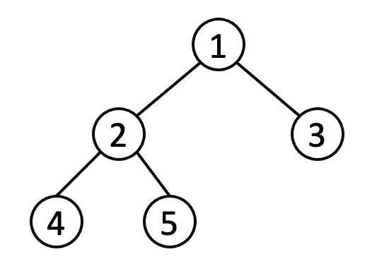
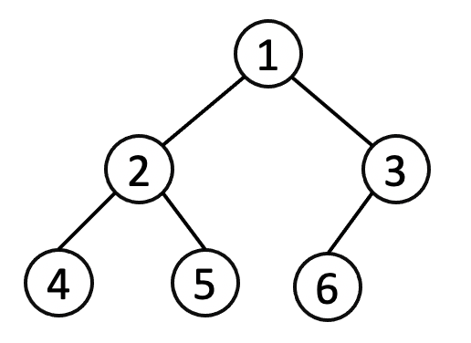
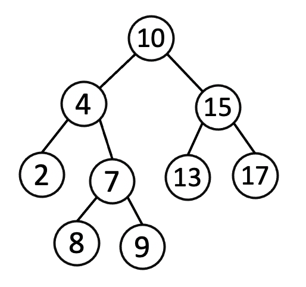
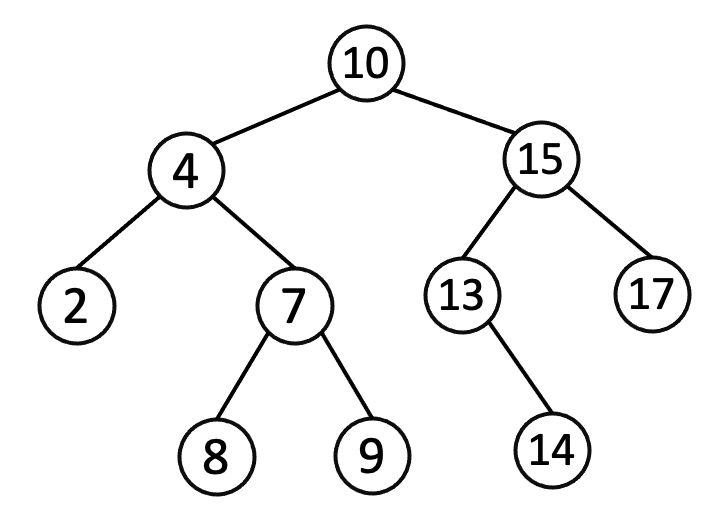
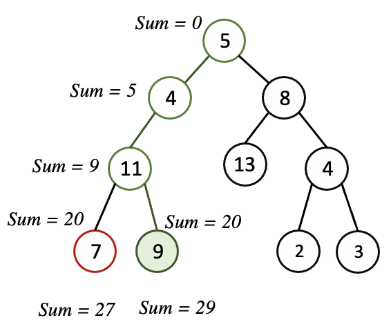
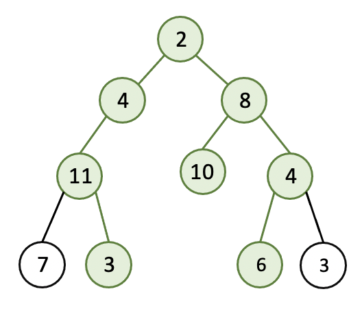
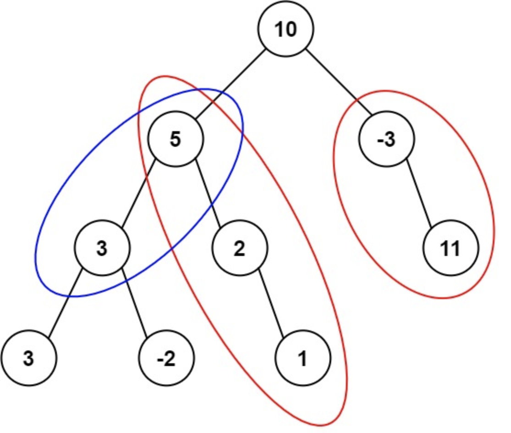

# Solution

#### Sum of Two Numbers
Given an array of integers `nums` and an integer `target`, return indices of the two numbers such that they add up to target.

You may assume that each input would have exactly one solution, and you may not use the same element twice.

You can return the answer in any order.

Example: 
```
Input: nums = [2,7,11,15], target = 9
Output: [0,1]
Output: Because nums[0] + nums[1] == 9, we return [0, 1].

Input: nums = [11,15,7,-6,1], target = 9
Output: [1,3]
Output: Because nums[1] + nums[3] == 9, we return [1, 3].
```

**Solution**
Brute-force solution will be compare every two numbers in the given array and check their 
sum with target. We will need two loops to get the combinations with every two numbers which
will cause *O(n^2)* time complexity and *O(1)* space complexity.

In the above solution we are evaluating each number twice, first pick one number and then pick 
another from the list. Can we do it with single pass.

Here is the formula for the problem: `num1 + num2 = target`, we can modify a little, `num1 = target - num2`.
For a given array  and target, target is constant in the equation. Target value is not changing. Then 
there are two variables only, `num1` and `num2`. 

The idea is to save every number that is visited so far, also keep their index. Then for every new number 
 we will calculate `target-num2` and check if we have seen the value. If  `num1 + num2 = target` then
 at some point there will be a match. Then we get the index from the previously seen number and 
 use current index as result.

*Time Complexity*: *O(n)*\
*Space Complexity*: *O(n)* 

#### Best Time to Buy and Sell Stock
You are given an array prices where `prices[i]` is the price of a given stock on the *i-th* day.

You want to maximize your profit by choosing a single day to buy one stock and choosing 
a different day in the future to sell that stock.

Return the maximum profit you can achieve from this transaction. If you cannot 
achieve any profit, return 0.

Example: 
```
Input: prices = [7,1,5,3,6,4]
Output: 5
Explanation: Buy on day 2 (price = 1) and sell on day 5 (price = 6), profit = 6-1 = 5.
Note that buying on day 2 and selling on day 1 is not allowed because you must buy before you sell.

Input: prices = [7,6,4,3,1]
Output: 0
Explanation: In this case, no transactions are done and the max profit = 0.
```
**Solution**:
Maximum profit depends on two things buy in minimum price and sell in maximum price, with condition that
selling price has to be a later date then buying date. 
For single pass linear time solution we need to think of few cases:
* Only minimum buying price won't guarantee maximum profit, there has to be a selling price after that day with more deviation.
* Any prices which  is maximum in the list won't maximize profit, consider like this: `[6,8,1,4,5,7,1]`. `8` is maximum but there  is only
one purchase possible before that which is `6` which doesn't maximize  the profit.

So we can keep track of minimum and maximum profit. We will update the minimum value as soon as 
there is a price less than the current minimum. And, we will calculate profit if  
the difference between current price and minimum price is greater than last maximum profit.

*Time Complexity*: *O(n)*\
*Space Complexity*: *O(1)* 

[Implementation ](java/com/dsalgo/practice/BuyAndSellStockLE.java)
 
A slightly modified version of the problem: Now you need to return the indices of the days
to buy and sell to have maximum profit.

It will be the same approach as before with little change, we will keep track of 
the day to purchase(minimum  price) temporarily. A temporary purchase day will be 
fixed when we have a profit which is greater than last profit.\
[Implementation ](java/com/dsalgo/practice/BuyAndSellStockLE.java) 

#### Verifying an Alien Dictionary
In an alien language, surprisingly they also use english lowercase letters, but possibly in a different order. The order of the alphabet is some permutation of lowercase letters.

Given a sequence of words written in the alien language, and the order of the alphabet, return true if and only if the given words are sorted lexicographicaly in this alien language.

**Solution**: 
Solution is simple for this problem. We need to parse alphabets and store their position in a hash map. Then use this hashmap
to compare lexicographic ordering.
Another idea is that in a list of words, say `w1, w2, w3 .. wn`, if all the words ordered lexicographically then if we pick any two
consecutive words they will be ordered as well.

[Implementation ](java/com/dsalgo/practice/VerifyingAnAlienDictionary.java)


#### Maximum subarray sum
Given an integer array nums, find the contiguous subarray (containing at least one number) which has the largest sum and return its sum.

Example:
```
Input: nums = [-2,1,-3,4,-1,2,1,-5,4]
Output: 6
Explanation: [4,-1,2,1] has the largest sum = 6.

Input: nums = [1]
Output: 1

Input: nums = [0]
Output: 0

Input: nums = [-1]
Output: -1
``` 

**Solution**
Key point to notice: sum of contiguous subarray, that means there will be start and end of elements. 
Summing the whole array won't guarantee maximum sum. So how do we solve this in linear time. 

As the sum will be the result of contiguous subarray, we need to carry over the previous sum.
At each step we need to calculate maximum sum at current position. and keep a record of maximum sum seen so far.

How to determine wheather we should carry over previous sum or start form current element?
If the sum of previous sum and current number is less than current number then we can decide 
to start from current number as previous sum is decreasing the sum. And we keep the max sum in 
a variable which will store max sum seen so far, not the current max sum.

*Time Complexity*: *O(n)*\
*Space Complexity*: *O(1)* 

Implementation: [Java](java/com/dsalgo/practice/SubArrayMaximumSum.java)  [Python](./python/SubArrayMaximumSum.py)
 
#### Valid Parentheses
Given a string s containing just the characters `(`, `)`, `{`, `}`, `[` and `]`, determine if the input string is valid.

An input string is valid if:

* Open brackets must be closed by the same type of brackets.
* Open brackets must be closed in the correct order.

Example:
```
Input: s = "()"
Output: true

Input: s = "()[]{}"
Output: true

Input: s = "(]"
Output: false

Input: s = "([)]"
Output: false

Input: s = "{[]}"
Output: true
```

**Solution**:
Scan the string by each character. Use a stack to store the opening brackets. Keep
the opening brackets in the stack. Keep pushing in the stack until a closing bracket is read.
We need a hash table to store the opening bracket for each closing bracket.
 
If a closing bracket is read then pop from the stack. For a valid parentheses the popped character 
should be the opening of same time. The idea is the bracket late should close first. At any point if a bracket is 
opened then it must close before any other closing bracket. 

*Time Complexity*: *O(n)*\
*Space Complexity*: *O(n)* 

Implementation: [Java](java/com/dsalgo/practice/ValidateParentheses.java)

### Merge two sorted linked lists
Merge two sorted linked lists and return it as a new sorted list. The new list should be made by splicing together the nodes of the first two lists.

Example:
```
Input: l1 = [1, 3, 6, 8], l2 = [2, 3, 7]
Output: [1, 2, 3, 6, 7, 8]
```

**Solution 1**:
We can solve this problem recursively by using the following formula: 
```
if list1[0]<list2[0]:
    list1[0]+merge(list1[1:],list2)
else:
    list2[0]+merge(list1,list2[1:])
```
**Time Complexity:**\
*O( m + n)*, *m* and *n* are number of items in two lists

**Space Complexity:**\
*O(m + n)*. The first call to mergeTwoLists does not return until the ends of both *list1* and *list2* have been reached, so *n + m* stack frames consume *O(n + m)* space.

[Implementation - Java](./java/src/com/ds/practice/MergeSortedLinkedList/MergeSortedList.java)

**Solution 2:**
We can solve this problem by using two pointers, one each at each linked list. 
Loop over until reach end of any list. Consider *l1* be a pointer in one of the linked list and *l2* be a pointer of other linked list.
Both of them are pointing at the head of linked lists. There will be two other pointers, *head*, *previous*. *head* will be initialized 
with -1, then the next node will be the smallest. *previous* pointer will be the previous node of last smallest node.

```
Step 1: Initialize head and previous pointer, point to a node with value -1 
Step 2: compare node at l1 and l2, find the lowest node. 
        a) point previous.next to the lowest node
        b) move pointer with lowest value to next. If l1 had the lowest element then move l1 
            to next and point previous to l1 previous value, the last lowest value
         
Step 3: Repeat until any one of the linked list reaches to the end.
        a) At the end of a linked list the node will be null.
Step 4: Add remaining elements 
        a) If l1 ended then point last lowest nodes next to l2.
        b) If l2 ended then point last lowest nodes next to l1.
```

**Time Complexity:**\
*O( m + n)*, *m* and *n* are number of items in two lists

**Space Complexity:**\
*O(1)*

### Add numbers represented in string
Given two numbers, write a function to calculate the sum of the numbers. Input numbers are in string.

Note:
* numbers contains only digits 0-9.
* numbers does not contain any leading zero.
* must not use any built-in BigInteger library or convert the inputs to integer directly.

Example:
```
num1: 123 
num2: 987
Sum: 1110
```
**Solution**:
This is elementary math. Add to digits at a time from the right and carry over carry to left if there is any. Use a new string to
store the result. 

**Time Complexity:**\
*O(M)*, *M* is maximum lengths of the numbers. 

**Space Complexity:**\
*O(M)*, *M* is maximum lengths of the numbers + 1, This if for result string.

[Implementation - Java](java/com/dsalgo/practice/AddTwoNumbers.java)


#### Reverse Integer
Given a signed 32-bit integer x, return x with its digits reversed. If reversing x causes the value to go outside the signed 32-bit integer range [-231, 231 - 1], then return 0.

Assume the environment does not allow you to store 64-bit integers (signed or unsigned).

Example: 
```
Input: x = 987
Output: 789

Input: x = -987
Output: -789

Input: x = 1000
Output: 1

Input: x = 2147483647
Output: 0

Input: x = -2147483648
Output: 0
```

**Solution**:
The idea is to get the last digit from the number and place in the first position.

To get the last digit we can use modulas operation. After getting last digit we need
to reset the input, for this we will divide the number by 10. Then we multiply previously 
reversed value by 10 and add last digit.

For example, num1 = 123.\
Iteration 1:\
reversed = 0
last digit = num1 % 10 = 123 % 10 = 3
num1 = num1/10 = 123 / 10 = 12
reversed = reversed * 10 + last digit = 0 * 10 + 3 = 3

Iteration 2:\
last digit = num1 % 10 = 12 % 10 = 2
num1 = num1/10 = 12 / 10 = 1
reversed = reversed * 10 + last digit = 3 * 10 + 2 = 32

Iteration 3:\
last digit = num1 % 10 = 1 % 10 = 1
num1 = num1/10 = 1 / 10 = 0
reversed = reversed * 10 + last digit = 32 * 10 + 1 = 321

We need to check 32-bit integer range before updating reversed value:
```
// positive limit
if reversed > 2^32/10 || reversed == 2^32 && last digit > 7: 
    return 0
// negative limit
if reversed < 2^32-1/10 || reversed == 2^32-1 && last digit < 8: 
    return 0
```

**Time Complexity:**\
*O(log(x))*, There are roughly *log_10(x)* digits in *x*.

**Space Complexity:**\
*O(1)*

[Implementation - Java](java/com/dsalgo/practice/ReverseInteger.java)


#### Sort logs

You have an array of logs.  Each log is a space delimited string of words.

For each log, the first word in each log is an alphanumeric identifier.  Then, either:

* Each word after the identifier will consist only of lowercase letters, or;
* Each word after the identifier will consist only of digits.
We will call these two varieties of logs letter-logs and digit-logs.  It is guaranteed that each log has at least one word after its identifier.

Reorder the logs so that all of the letter-logs come before any digit-log.  The letter-logs are ordered lexicographically ignoring identifier, with the identifier used in case of ties.  The digit-logs should be put in their original order.

Return the final order of the logs.

Example:
```
Input: ["dig1 8 1 5 1","let1 art can","dig2 3 6","let2 own kit dig","let3 art zero"] 
Output: [let1 art can, let3 art zero, let2 own kit dig, dig1 8 1 5 1, dig2 3 6]

Input: ["t kvr", "r 3 1", "i 403", "7 so", "t 54"] 
Output: [t kvr, 7 so, r 3 1, i 403, t 54]

Input: ["a1 9 2 3 1","g1 act car","zo4 4 7","ab1 off key dog","a8 act zoo"] 
Output: [g1 act car, a8 act zoo, ab1 off key dog, a1 9 2 3 1, zo4 4 7]

Input: ["a1 9 2 3 1","g1 act car","zo4 4 7","ab1 off key dog","a8 act zoo","a2 act car"] 
Output: [a2 act car, g1 act car, a8 act zoo, ab1 off key dog, a1 9 2 3 1, zo4 4 7]

```

**Solution**:
We can write a custom comparator and sort the array using the comparator.
We need to sort only the letter-logs, keep the digit logs at the same place.

You may write your own comparator instead of built-in comparators.

[Implementation - Java](java/com/dsalgo/practice/SortLogs.java)

#### Palindrome Linked List
Given a singly linked list, determine if it is a palindrome.

Example:
```
Input: 1
Output: true

Input: 1->2
Output: false

Input: 1 -> 1 -> 1
Output: true

Input: 1->2->2->1
Output: true

Input: 1 -> 2 -> 3 -> 1
Output: false

Input: 1 -> 3 -> 2 -> 3 -> 1
Output: true
```

**Solution**:
We can find the middle node of linked list. Then, reverse the linked list from the middle to the end.
If a linked list is a palindrome then the linked list from head to middle node or first half and the reversed 2nd half will be same.

*Time complexity : O(n)*, where *n* is the number of nodes in the Linked List.\
*Space complexity : O(1)*.

[Implementation - Java](java/com/dsalgo/practice/PalindromeLinkedList.java)

#### Design min-stack
Design a stack that supports push, pop, top, and retrieving the minimum element in constant time.

* push(x) -- Push element x onto stack.
* pop() -- Removes the element on top of the stack.
* top() -- Get the top element.
* getMin() -- Retrieve the minimum element in the stack.

Example: 
```
Input
["MinStack","push","push","push","getMin","pop","top","getMin"]
[[],[-2],[0],[-3],[],[],[],[]]

Output
[null,null,null,null,-3,null,0,-2]

Explanation
MinStack minStack = new MinStack();
minStack.push(-2);
minStack.push(0);
minStack.push(-3);
minStack.getMin(); // return -3
minStack.pop();
minStack.top();    // return 0
minStack.getMin(); // return -2
```
**Solution**
We can use a builtin stack to meet push, pop and top functionality. But we need to modify the stack functionality 
to implement `getMin()`. We can keep track of minimum value seen so far and store 
in the stack.
For example:
```
push(-2);
min = [-2];

push(0);
min = [-2,-2];

push(-3);
min = [-2,-2,-3];

getMin(); // return -3

pop();
min = [-2, -2]

top();    // return 0

getMin(); // return -2
``` 

[Implementation - Java](java/com/dsalgo/practice/MinStack.java)


#### Subdomain Visit Count
A website domain like "discuss.leetcode.com" consists of various subdomains. At the top level, we have "com", at the next level, we have "leetcode.com", and at the lowest level, "discuss.leetcode.com". When we visit a domain like "discuss.leetcode.com", we will also visit the parent domains "leetcode.com" and "com" implicitly.

Now, call a "count-paired domain" to be a count (representing the number of visits this domain received), followed by a space, followed by the address. An example of a count-paired domain might be "9001 discuss.leetcode.com".

We are given a list cpdomains of count-paired domains. We would like a list of count-paired domains, (in the same format as the input, and in any order), that explicitly counts the number of visits to each subdomain.

Example:
```
Example 1:
Input: 
["9001 discuss.leetcode.com"]
Output: 
["9001 discuss.leetcode.com", "9001 leetcode.com", "9001 com"]
Explanation: 
We only have one website domain: "discuss.leetcode.com". As discussed above, the subdomain "leetcode.com" and "com" will also be visited. So they will all be visited 9001 times.

Example 2:
Input: 
["900 google.mail.com", "50 yahoo.com", "1 intel.mail.com", "5 wiki.org"]
Output: 
["901 mail.com","50 yahoo.com","900 google.mail.com","5 wiki.org","5 org","1 intel.mail.com","951 com"]
Explanation: 
We will visit "google.mail.com" 900 times, "yahoo.com" 50 times, "intel.mail.com" once and "wiki.org" 5 times. For the subdomains, we will visit "mail.com" 900 + 1 = 901 times, "com" 900 + 50 + 1 = 951 times, and "org" 5 times.

```

**Solution**\
This problem is related to string operation and hash table. We iterate over each *count-paired domain*:
* First split the string by space to separate visit count and domain
* Then split the second portion or pervious result(the domain) by `dot`.
* Now iteratee over the sub-domains achieved after splitting by dot:
    * for each domain store the count in  hash table 
    * update the domain by prepending the sub-domains


*Time complexity : O(n)*\
*Space complexity : O(n)* 

[Implementation - Java](java/com/dsalgo/practice/SubDomainCount.java)

#### Design HashMap
Design a HashMap without using any built-in hash table libraries.

To be specific, your design should include these functions:

* put(key, value) : Insert a (key, value) pair into the HashMap. If the value already exists in the HashMap, update the value.
* get(key): Returns the value to which the specified key is mapped, or -1 if this map contains no mapping for the key.
* remove(key) : Remove the mapping for the value key if this map contains the mapping for the key.

Example:
```
MyHashMap hashMap = new MyHashMap();
hashMap.put(1, 1);          
hashMap.put(2, 2);         
hashMap.get(1);            // returns 1
hashMap.get(3);            // returns -1 (not found)
hashMap.put(2, 1);          // update the existing value
hashMap.get(2);            // returns 1 
hashMap.remove(2);          // remove the mapping for 2
hashMap.get(2);            // returns -1 (not found) 
```

[Implementation - Java](java/com/dsalgo/practice/DesignHashMap.java)

#### Find longest common prefix
Given an array of strings, find longest common  prefix. If there is no common prefix, return an empty string "".

Example:
```
Input: strs = ["flower","flow","flight"]
Output: "fl"

Input: strs = ["dog","racecar","car"]
Output: ""
Explanation: There is no common prefix among the input strings.
```

**Solution**:\
There are different ways we can solve this problem.

**Solution 1**: As the longest common prefix will be common for all the strings we can first find longest compare prefix for first two string, then find 
longest common prefix of the first result and next word as long as we get a result other than empty string. We can consider the process as horizontal scanning.

```
LCP(S1...Sn) = LCP(LCP(LCP(S1,S2),S3),..Sn)

Example: [good, google, goo, god]
LCP(good, google) = goo
LCP(goo, goo) = goo
LCP(goo, god) = go

Example: [good, google, goo, god, dog]
LCP(good, google) = goo
LCP(goo, goo) = goo
LCP(goo, god) = go
LCP(go, dog) = ""
```

Worse case result will be when you have some common prefix in n-1 strings and the last string doesn't 
have any common prefix, if n is large it will be worse.
**Time Complexity:**\
*O(S)* S is sum of all the characters in all strings.\
**Space Complexity:**\
*O(1)*

**Solution 2**: Consider  a case where there is a very short string at the end of the array. Then according to 
horizontal scanning  it will take more operations. To optimize we my use vertical scanning approach.
We can check characters of all the given string vertically. Like first compare first 
character of all the strings. If first character is common for all then we move to next character at 2nd postion; otherwise
terminate the check and return result. The result will be from beginning to last common character.\
**Time Complexity:**\
*O(S)* S is sum of all the characters in all strings.\
**Space Complexity:**\
*O(1)*

**Solution 3**: We can use divide and conquer approach. Keep split the strings until there are two strings in a 
group. As soon as there are one/two strings, find longest common prefix. Then merge the results by finding 
longest common prefix of those results.

```
LCP(S1...Sn) = LCP(LCP(S1..Sk),LCP(Sk+1...Sn)) , where LCP(S_1 ... S_n) is the 
longest common prefix in set of strings [S_1 .... S_n] ,1 < k < n_1

[good, gold, gone, google, goo, god]

Divide -> [good, gold, gone]       [google, goo, god]
Divide -> [good, gold] [gone]      [google, goo] [god]
LCP           [go]     [gone]          [goo]     [god]
Conquer ->        [go]                       [go]
Conquer ->                     [go]
``` 

**Time Complexity:**\
*O(S)* S is sum of all the characters in all strings.\
**Space Complexity:**\
*O(m lon n)*, There is a memory overhead since we store recursive calls in the execution stack. There are *n log n* recursive calls, each store need mm space to store the result, 
so space complexity is *O(m log n)*

**Solution 4**:
Binary search, The idea is to apply binary search method to find the string with maximum value *L*, which is common prefix 
of all of the strings. The algorithm searches space is the interval (*0....minLen*), where *minLen* is minimum string length 
and the maximum possible common prefix. Each time search space is divided in two equal parts, one of them is discarded, 
because it is sure that it doesn't contain the solution. There are two possible cases:
* `S[1...mid]` is not a common string. This means that for each `j > i` `S[1..j]` is not a common string and we discard the second half of the search space.
* `S[1...mid]` is common string. This means that for each `i < j` `S[1..i]` is a common string and we discard the first half of the search space, 
   because we try to find longer common prefix.

Example:
```
                [factory, factions, fact, factional, facture]
                                    |
                                "factory"
                             /             \
                          fact              ory        middle index = 3
               fact in (factions, fact, 
                factional, facture)
                
                as all of words has prefix "fact", now  expand to right 
                                "factory"
                             /             \
                          fact            o - ry
              "facto" in factions - no,
              "facto" in fact - no,
              "facto" in factional - no,
              "facto" in facture - no
            
             LCP  is fact         
```

[Implementation - Java](java/com/dsalgo/practice/LongestCommonPrefix.java)

### Validate palindrome
Given a string, determine if it is a palindrome, considering only alphanumeric characters and ignoring cases.

Note: For the purpose of this problem, we define empty string as valid palindrome.

**Solution**:
We can use two pointer, one will scan from left to right another from  right to left. We will return false if the
 *n-th* character from the last is not same as *n-th* character from  beginning.

**Time Complexity:**\
*O(n)*
**Space Complexity:**\
*O(1)*

[Implementation - Java](java/com/dsalgo/practice/ValidPalindrome.java)

#### Fizz Buzz
Write a program that outputs the string representation of numbers from 1 to n.

But for multiples of three it should output “Fizz” instead of the number and for 
the multiples of five output “Buzz”. For numbers which are multiples of both three and five output “FizzBuzz”.

Example:
```
n = 15,

Return:
[
    "1",
    "2",
    "Fizz",
    "4",
    "Buzz",
    "Fizz",
    "7",
    "8",
    "Fizz",
    "Buzz",
    "11",
    "Fizz",
    "13",
    "14",
    "FizzBuzz"
]
```

**Solution**:
Simple solution will be iterate over the range(1 to n) and checking if a number is divisible by 3 and/or 5 which will decide "Fizz", "Buzz", "FizzBuzz" or number.

Consider if there are more mappings: like 
* "Fizz" for multiple of 3
* "Buzz" for multiple of 5
* "Jazz" for multiple of 11
For three mapping there are 8 conditions(all combinations) to check.
```
Divisible by 3
Divisible by 5
Divisible by 11
Divisible by 3 and 5
Divisible by 3 and 11
Divisible by 11 and 3
Divisible by 3 and 5 and 11
Not divisible by 3 or 5 or 11.
```
Instead of writing nested if-else condition we can decouple it using string concatenation.

```
result = ""
if num % 3 == 0:
    result += "Fizz"
if num % 5 == 0:
    result += "Buzz"
if num % 11 == 0:
    result += "Buzz"
```

If the number are conditions are too many then we can make the mapping check dynamic by using hash table, and 
It will be easy to remove/update any mapping with minor code change


**Time Complexity:**\
*O(n)*
**Space Complexity:**\
*O(1)* For hash map approach space complexity will be *O(m)*, *m* is the number of mapping.\
[Implementation - Java](java/com/dsalgo/practice/FizzBuzz.java)

#### Minimum Moves to Equal Array Elements
Given a non-empty integer array of size *n*, find the minimum number of moves required 
to make all array elements equal, where a move is incrementing *n - 1* elements by *1*.

Example:
```
Input:
[1,2,3]

Output:
3

Explanation:
Only three moves are needed (remember each move increments two elements):

[1,2,3]  =>  [2,3,3]  =>  [3,4,3]  =>  [4,4,4]

Input:
[1,2,5]

Output:
5

[1,2,5] => [2,3,5] => [3,4,5] => [4,5,5] => [5,6,5] => [6,6,6]
```
**Solution**
Few key points to solve this problem:
* to make something equal we need to increase the ones which are lower
* Should not increase the maximum number, increasing the maximum number will lead to unresolved situation.

*Brute force solution:*\ 
First we find the maximum number and increment all the numbers except maximum till maximum number. Actually,
we need to increment *n* times such that the minimum number equal to the maximum. After that,  if 
all the numbers are not same then find maximum and minimum again and repeat the process. \
Time complexity: *O(n^2 * k)* and Space Complexity: *O(1)*\

We can optimize previous approach by incrementing in chunks. In previous approach we incremented every number 
by 1 at each iteration. Actually we have to increment the minimum number to maximum number, so we can calculate
difference between minimum and maximum and increment each number by that difference.
Time complexity: *O(n^2)* and Space Complexity: *O(1)*\

We can do further optimization by reducing the computation of searching minimum and maximum 
in the array. We can sort the array to have constant computation to find  minimum and maximum number.
Another idea is that we may not need to update the numbers, we can compute minimum number of moves
using minimum and maximum information.

```
Minimum number of moves = sum of (num[i] - num[min])
```
Lets verify how that will work: Lets take a example `[a0,a1,a2....an]`. Consider `a0= 1` and `an=4`, then 
to make *a0* equal to *an* we need to increment *a0* (*diff0=an-a0*) times. Now, count will be *count = diff0*.
After the moves all the numbers *a1,a2 ... a_n-1* will also increment by *diff0*. New maximum value will be a_n-1. Now if a_n-1 is greater than a0 then 
now it will take diff1 = a_n-1 - a0 increment to make a0 equal to new maximum. Repeat this process.

Time complexity: *O(n log n)*, *O(log n)* for sorting 
and Space Complexity: *O(1)*\

We can do further optimization, sorting was reducing maximum and minimum number finding. We can do one single round 
to find the minimum number and use difference between minimum number and all other number to count minimum moves.

Time complexity: *O(n)*  and Space Complexity: *O(1)*\

[Implementation - Java](java/com/dsalgo/practice/MinimumMovesToEqualArray.java)

#### Convert a string to palindrome with at most one deletion
Given a non-empty string `s`, you may delete at most one character. Judge whether you can make it a palindrome.

Example:
```
Input: "aba"
Output: True

Input: "abca"
Output: True
Explanation: You could delete the character 'c'.
```

**Solution**:
We can find the middle index and iterate till middle index. At each iteration we will check the character at i-th index from the begining and i-th character form the end.
If they are not maching then we should check two things:
* If we remove i-th character from the begining then will it be a valid palindrome ?
* If we remove i-th character from the end then will it be a valid palindrome ?

If one of the above is true then we conclude that the string is valid palindrome after 
deleting one character; otherwise false.

**Time Complexity:**\
*O(n)*, *n* is the length of the string.
**Space Complexity:**\
*O(1)*
[Implementation - Java](java/com/dsalgo/practice/ConvertAStringToPalindrome.java)

#### Move zeros
Given an array nums, write a function to move all 0's to the end of it while
 maintaining the relative order of the non-zero elements.
 
Example:
```
Input: [0,1,0,3,12]
Output: [1,3,12,0,0]
``` 

**Solution**
We could have just swapped the zeors to last position but it will break relative ordering 
of the non-zero numbers. So we will have a pointer variable refer  to the array index of 
next non-zero element position. Initially it will be set to zero then increments on every swap. 
We will do swap when the current index is pointing to 0.

**Time Complexity:**\
*O(n)*
**Space Complexity:**\
*O(1)*
[Implementation - Java](java/com/dsalgo/practice/MoveZeros.java)

#### Palindrome Number
Given an integer x, return true if x is palindrome integer.

An integer is a palindrome when it reads the same backward as forward. 

Could you solve it without converting the integer to a string?

For example, 121 is palindrome while 123 is not.
```
Input: x = 121
Output: true

Input: x = -121
Output: false
Explanation: From left to right, it reads -121. From right to left, it becomes 121-. Therefore it is not a palindrome.

Input: x = 10
Output: false
Explanation: Reads 01 from right to left. Therefore it is not a palindrome.

Input: x = -101
Output: false
```

**Solution**
The simple solution would be convert the number to string and then compare the characters.

We can revert the number and  check if given number is same as reverted number.

**Time Complexity:**\
*O(n)*
**Space Complexity:**\
*O(1)*\
[Implementation - Java](java/com/dsalgo/practice/PalindromeNumber.java)


#### Construct K Palindrome Strings
Given a string and an integer *k*. You should construct *k* non-empty palindrome strings using all the characters in the string.

Return *True* if you can use all the characters in the string to construct *k* palindrome strings or *False* otherwise.

Example:
```
Input: s = "annabelle", k = 2
Output: true
Explanation: You can construct two palindromes using all characters in s.
Some possible constructions "anna" + "elble", "anbna" + "elle", "anellena" + "b"

Input: s = "good", k = 4
Output: true
Explanation: The only possible solution is to put each character in a separate string.

Input: s = "yzyzyzyzyzyzyzy", k = 2
Output: true
Explanation: Simply you can put all z's in one string and all y's in the other string. Both strings will be palindrome.
```

**Solution**
Maximum number of palindrome from a  given string will be the length of the string by taking 
each character as single character palindrome. So if *k* > string length then we can't construct 
that many palindrome. 

Now if the *k* < string length it may be possible  to construct *k* palindrome.
Creating palindrome will depend on the number of character count. If all the character
appearance count is even then surely we can construct k palindrome. 
If a string is a palindrome, and if we pick one letter then for each letter there has to be 
a pair so that the same latter will be in same position if we read the string left to right or right to left.
Otherwise the letter is at the middle of the palindrome string.

In a palindrom string there can be only one letter whose character count is odd:
```
aabaa - here b is odd and count is 1
aabbbaa - here b is odd and count is 3
abcdcba -  here d is odd and count is 1
```
So in a given string if there are two letter with odd character count then
to create palindrome we need to split the string in to two palindrome string because
each palindrom string can have at most one letter with odd character count.

So, we will scan the string and keep the letter count in a hash table. Count the number of 
letter with odd character count. If k is less than the number of letters with odd character count
then return false otherwise return true.

**Time Complexity:**\
*O(n)*
**Space Complexity:**\
*O(n)* for hash table \
[Implementation - Java](java/com/dsalgo/practice/ConstructKPalindromeStrings.java)

#### Text Justification
Given an array of words and a width *maxWidth*, format the text such that each line has exactly *maxWidth* characters and is fully (left and right) justified.

You should pack your words in a greedy approach; that is, pack as many words as you can in each line. Pad extra spaces `' '` when necessary 
so that each line has exactly *maxWidth* characters.

Extra spaces between words should be distributed as evenly as possible. If the number of spaces on a line do not divide evenly between words, 
the empty slots on the left will be assigned more spaces than the slots on the right.

For the last line of text, it should be left justified and no extra space is inserted between words.

Note:
* A word is defined as a character sequence consisting of non-space characters only.
* Each word's length is guaranteed to be greater than 0 and not exceed maxWidth.
* The input array words contains at least one word.


[Implementation - Java](java/com/dsalgo/practice/TextJustification.java)

#### Rearrange Spaces Between Words
You are given a string text of words that are placed among some number of spaces. 
Each word consists of one or more lowercase English letters and are separated by 
at least one space. It's guaranteed that text contains at least one word.

Rearrange the spaces so that there is an equal number of spaces between every pair 
of adjacent words and that number is maximized. If you cannot redistribute all the 
spaces equally, place the extra spaces at the end, meaning the returned string 
should be the same length as text.

Return the string after rearranging the spaces.

Example: 
```
Input: text = "  this   is  a sentence "
Output: "this   is   a   sentence"
Explanation: There are a total of 9 spaces and 4 words. 
We can evenly divide the 9 spaces between the words: 9 / (4-1) = 3 spaces.

Input: text = " practice   makes   perfect"
Output: "practice   makes   perfect "
Explanation: There are a total of 7 spaces and 3 words. 7 / (3-1) = 3 spaces plus 1 extra space. 
We place this extra space at the end of the string.

Input: text = "hello   world"
Output: "hello   world"

Input: text = "  walks  udp package   into  bar a"
Output: "walks  udp  package  into  bar  a "

Input: text = "a"
Output: "a"
```

[Implementation - Java](java/com/dsalgo/practice/RearrangeSpacesBetweenWords.java)


#### Reconstruct Itinerary
Given a list of airline tickets represented by pairs of departure and arrival airports
 [from, to], reconstruct the itinerary in order. All of the tickets belong to a man 
 who departs from JFK. Thus, the itinerary must begin with JFK.

Note:
* If there are multiple valid itineraries, you should return the itinerary that has the smallest lexical order when read as a single string. For example, the itinerary ["JFK", "LGA"] has a smaller lexical order than ["JFK", "LGB"].
* All airports are represented by three capital letters (IATA code).
* You may assume all tickets form at least one valid itinerary.
* One must use all the tickets once and only once.

Example:
```
Input: [["MUC", "LHR"], ["JFK", "MUC"], ["SFO", "SJC"], ["LHR", "SFO"]]
Output: ["JFK", "MUC", "LHR", "SFO", "SJC"]

Input: [["JFK","SFO"],["JFK","ATL"],["SFO","ATL"],["ATL","JFK"],["ATL","SFO"]]
Output: ["JFK","ATL","JFK","SFO","ATL","SFO"]
Explanation: Another possible reconstruction is ["JFK","SFO","ATL","JFK","ATL","SFO"].
             But it is larger in lexical order.
```

[Implementation - Java](java/com/dsalgo/practice/ReconstructItinerary.java)

#### Count Number of Islands
Given an m x n 2d grid map of `1's` (land) and `'0's` (water), return the number of islands.

An island is surrounded by water and is formed by connecting adjacent lands horizontally or vertically. 
You may assume all four edges of the grid are all surrounded by water.

Example:
```
Input: grid = [
  ["1","1","1","1","0"],
  ["1","1","0","1","0"],
  ["1","1","0","0","0"],
  ["0","0","0","0","0"]
]
Output: 1

Input: grid = [
  ["1","1","0","0","0"],
  ["1","1","0","0","0"],
  ["0","0","1","0","0"],
  ["0","0","0","1","1"]
]
Output: 3 
```


[Implementation - Java](java/com/dsalgo/practice/NumberOfIslands.java)

#### Interval List Intersections
You are given two lists of closed intervals, firstList and secondList, where `firstList[i] = [start_i, end_i]` and `secondList[j] = [start_j, end_j]`. 
Each list of intervals is pairwise disjoint and in sorted order.

Return the intersection of these two interval lists.

A closed interval `[a, b]` (with a < b) denotes the set of real numbers `x` with `a <= x <= b`.

The intersection of two closed intervals is a set of real numbers that are either empty or represented as a closed interval. 
For example, the intersection of [1, 3] and [2, 4] is [2, 3].

Example:
```
Input: firstList = [[0,2],[5,10],[13,23],[24,25]], secondList = [[1,5],[8,12],[15,24],[25,26]]
Output: [[1,2],[5,5],[8,10],[15,23],[24,24],[25,25]]

Input: firstList = [[1,3],[5,9]], secondList = []
Output: []

Input: firstList = [], secondList = [[4,8],[10,12]]
Output: []

Input: firstList = [[1,7]], secondList = [[3,10]]
Output: [[3,7]]
```
[Implementation - Java](java/com/dsalgo/practice/IntervalListIntersections.java)


#### Task Scheduler
Given a characters array tasks, representing the tasks a CPU needs to do, where each letter represents a 
different task. Tasks could be done in any order. Each task is done in one unit of time. For each unit of 
time, the CPU could complete either one task or just be idle.

However, there is a non-negative integer n that represents the cooldown period between two same tasks 
(the same letter in the array), that is that there must be at least n units of time between any two same tasks.

Return the least number of units of times that the CPU will take to finish all the given tasks.

Example:
```
Input: tasks = ["A","A","A","B","B","B"], n = 2
Output: 8
Explanation: 
A -> B -> idle -> A -> B -> idle -> A -> B
There is at least 2 units of time between any two same tasks.


Input: tasks = ["A","A","A","B","B","B"], n = 0
Output: 6
Explanation: On this case any permutation of size 6 would work since n = 0.
["A","A","A","B","B","B"]
["A","B","A","B","A","B"]
["B","B","B","A","A","A"]

Input: tasks = ["A","A","A","A","A","A","B","C","D","E","F","G"], n = 2
Output: 16
Explanation: 
One possible solution is
A -> B -> C -> A -> D -> E -> A -> F -> G -> A -> idle -> idle -> A -> idle -> idle -> A
```

**Solution**:
In bruteforce approach, first we can count the occurance of the leters/tasks. Then create a data structure with
last position of a task and available counts. Then in a loop select a task/letter if current position is *n* inxed 
away from the last position of curreent task, otherwise try to add another task if available. If not available then 
add idle. Repeat this processes until all the tasks are done.

Lets try to solve the problem little intelligently. For each task/letter it will required at-least one unit of time,
then the final reasult will be something like this: `task length + more`. We need to place same task with difference *n*, 
so we can think `more` to be the number of idle time.

Now for a giver list of tasks, the maximum number of idle time will depend of the task with max frequency. 
So idle time range will be 0 to `(task_fq_max - 1) * n`. Now the idea is to fill the idle times with the tasks 
other than the maximum occurrence task and deduct the frequency from total idle time.

So final result will be length of the tasks and remaining idle time.

**Time Complexity:**\
*O(N)*, `N` is the total number of tasks.
**Space Complexity:**\
*O(1)*\

[Implementation - Java](java/com/dsalgo/practice/TaskScheduler.java)


#### Sum Of Unique Elements
You are given an integer array nums. The unique elements of an array are the elements that appear exactly once in the array.

Return the sum of all the unique elements of nums.

Example: 
```
Input: nums = [1,2,3,2]
Output: 4
Explanation: The unique elements are [1,3], and the sum is 4.

Input: nums = [1,1,1,1,1]
Output: 0
Explanation: There are no unique elements, and the sum is 0.

Input: nums = [1,2,3,4,5]
Output: 15
Explanation: The unique elements are [1,2,3,4,5], and the sum is 15.
```
   
**Time Complexity:**\
*O(n)*
**Space Complexity:**\
*O(n)*\

[Implementation - Java](java/com/dsalgo/practice/TaskScheduler.java)


#### Next Warm Temperature
Given a list of daily temperatures T, return a list such that, for each day in the input, tells you how many 
days you would have to wait until a warmer temperature. If there is no future day for which this is possible, 
put 0 instead.

For example, given the list of temperatures T = [73, 74, 75, 71, 69, 72, 76, 73], your output should be [1, 1, 4, 2, 1, 1, 0, 0].

Note: The length of temperatures will be in the range [1, 30000]. Each temperature will be an integer in the range [30, 100].

Example:
```
Input: [73, 74, 75, 71, 69, 72, 76, 73]
Output: [1, 1, 4, 2, 1, 1, 0, 0]
```

[Implementation - Java](java/com/dsalgo/practice/DailyTemperature.java)


#### Validate Anagram
Given two strings s and t, return true if t is an anagram of s, and false otherwise.

Example:
```
Input: s = "abcd", t = "dcba"
Output: true

Input: s = "abcc", t = "abbc"
Output: false
```

**Time Complexity:**\
*O(n)*
**Space Complexity:**\
*O(n)*\

[Implementation - Java](java/com/dsalgo/practice/ValidateAnagram.java)


#### High Five
Given a list of the scores of different students, items, where `items[i] = [ID_i, score_i]` represents one score from a student with `ID_i`, calculate each student's top five average.

Return the answer as an array of pairs result, where `result[j] = [ID_j, topFiveAverage_j]` represents the student with `ID_j` and their top five average. Sort result by `ID_j` in increasing order.\
A student's top five average is calculated by taking the sum of their top five scores and dividing it by 5 using integer division.

Example:
```

```
**Time Complexity:**\
*O(n)*
**Space Complexity:**\
*O(n)*\

[Implementation - Java](java/com/dsalgo/practice/HighFive.java)


#### Binary Tree Level Order Traversal
Given the root of a binary tree, return the level order traversal of its nodes' values. (i.e., from left to right, level by level).

```
    6
   / \
  8   11
     /  \
    9    5   

Output: [[6], [8, 11], [9, 5]]
```

**Time Complexity:**\
*O(n)*
**Space Complexity:**\
*O(n)*\

[Implementation - Java](java/com/dsalgo/practice/TreeTraversalLevelOrder.java)

#### Binary Tree Vertical Order Traversal
Given the root of a binary tree, return the vertical order traversal of its nodes' values. 
(i.e., from top to bottom, column by column).

If two nodes are in the same row and column, the order should be from left to right.


**Time Complexity:**\
*O(n)*
**Space Complexity:**\
*O(n)*\

[Implementation - Java](java/com/dsalgo/practice/TreeTraversalVerticalOrder.java)

#### Vertical Order Traversal of a Binary Tree
Given the root of a binary tree, calculate the vertical order traversal of the binary tree.

For each node at position (row, col), its left and right children will be at positions (row + 1, col - 1) 
and (row + 1, col + 1) respectively. The root of the tree is at (0, 0).

The vertical order traversal of a binary tree is a list of top-to-bottom orderings for 
each column index starting from the leftmost column and ending on the rightmost column. 
There may be multiple nodes in the same row and same column. In such a case, sort these nodes by their values.

Return the **vertical order traversal** of the binary tree.


```
Input: root = [1,2,3,4,5,6,7]
Output: [[4],[2],[1,5,6],[3],[7]]
Explanation:
Column -2: Only node 4 is in this column.
Column -1: Only node 2 is in this column.
Column 0: Nodes 1, 5, and 6 are in this column.
          1 is at the top, so it comes first.
          5 and 6 are at the same position (2, 0), so we order them by their value, 5 before 6.
Column 1: Only node 3 is in this column.
Column 2: Only node 7 is in this column.
```

**Time Complexity:**\
*O(n log n)*
**Space Complexity:**\
*O(n)*\

[Implementation - Java](java/com/dsalgo/practice/TreeTraversalVerticalOrder2.java)

#### ZigZag Conversion
The string "PAYPALISHIRING" is written in a zigzag pattern on a given number of rows like this: (you may want to display this pattern in a fixed font for better legibility)
```
P   A   H   N
A P L S I I G
Y   I   R
```
And then read line by line: `PAHNAPLSIIGYIR`

Write the code that will take a string and make this conversion given a number of rows:
string convert(string s, int numRows);

```
Input: s = "PAYPALISHIRING", numRows = 3
Output: "PAHNAPLSIIGYIR"

Input: s = "PAYPALISHIRING", numRows = 4
Output: "PINALSIGYAHRPI"
Explanation:
P     I    N
A   L S  I G
Y A   H R
P     I

Input: s = "A", numRows = 1
Output: "A"
```

[Implementation - Java](java/com/dsalgo/practice/ZigZagConversion.java)  

#### Binary Tree Zigzag Level Order Traversal
Given the root of a binary tree, return the zigzag level order traversal of its nodes' values. (i.e., from left to right, then right to left for the next level and alternate between).

```
Input: root = [3,9,20,null,null,15,7]
Output: [[3],[20,9],[15,7]]
 
Input: root = [1]
Output: [[1]]

Input: root = []
Output: []
```

[Implementation - Java](java/com/dsalgo/practice/TreeTraversalZigZagOrder.java)  

#### Isomorphic Strings
Given two strings *s* and *t*, determine if they are isomorphic.\
Two strings *s* and *t* are isomorphic if the characters in s can be replaced to get *t*.

All occurrences of a character must be replaced with another character while preserving 
the order of characters. No two characters may map to the same character, but a character may map to itself.

```
Input: s="egg", t="add"
Output: true

Input: s="aabb", t="xyxy"
Output: false

Input: s="aabb", t="yyxx"
Output: true

Input: s="1223", t="7992"
Output: true
```

[Implementation - Java](java/com/dsalgo/practice/IsomorphicStrings.java)  


#### Design Parking System
Design a parking system for a parking lot. The parking lot has three kinds of parking spaces: big, medium, and small, with a fixed number of slots for each size.

Implement the ParkingSystem class:

* `ParkingSystem(int big, int medium, int small)` Initializes object of the Parking System class. The number of slots for each parking space are given as part of the constructor.
* `bool addCar(int carType)` Checks whether there is a parking space of carType for the car that wants to get into the parking lot. carType can be of three kinds: big, medium, or small, 
which are represented by 1, 2, and 3 respectively. A car can only park in a parking space of its carType. If there is no space available, return false, else park the car in that size space and return true.


[Implementation - Java](java/com/dsalgo/practice/DesignParkingSystem.java)  

####  Right Side View of Binary Tree
Given a binary tree, looking from the right side of it, return the values of the nodes you can see ordered from top to bottom.

**Example 1**
```
Input: [1,2,3,null,5,null,4]
Output: [1, 3, 4]
Explanation:

   1            <---
 /   \
2     3         <---
 \     \
  5     4       <---
```

**Solution**
Key observation for this problem is that we need to select one node for each level. Select the 
right most node in outer boundary. If right subtree doesn't exists then traverse left subtree.

We can use both Breath first and Depth first search. BFS will be more appriopriate as it search 
by level.

At each level we need to get the right most node. The idea is for each level we 
will push the nodes to a end of special queue(double ended queue). 
Then iterate over the elements in the queue and poll from the front end of the queue.
The last node in the queue will be the right most node.

**Time Complexity:**\
*O(n)*

**Space Complexity:**\
*O(D)*, *D* is tree diameter.

[Implementation - BFS - Java](java/com/dsalgo/practice/RightSideViewOfBinaryTree.java)

Using DFS: The idea is the keep exploring right child as farther as possible, and update level. 
At each level we will add one node to the result list, if right child is available we explore right 
otherwise left. At each level we compare the result list size vs level value, if the level value is
same as the result list size(0-indexed) then we add the node in the result list. If the level value 
is less then that result list size, which means we are backtracking and one node (right or left) 
node has been already added.

[Implementation - DFS - Java](java/com/dsalgo/practice/RightSideViewOfBinaryTree.java)


#### Course Schedule
There are a total of numCourses courses you have to take, labeled from `0` to numCourses - `1`. You are given an array prerequisites where prerequisites *[i] = [a_i, b_i]* indicates 
that you must take course *b_i* first if you want to take course *a_i*.

For example, the pair `[0, 1]`, indicates that to take course `0` you have to first take course `1`.
Return true if you can finish all courses. Otherwise, return false.

```
Input: numCourses = 2, prerequisites = [[1,0]]
Output: true
Explanation: There are a total of 2 courses to take. 
To take course 1 you should have finished course 0. So it is possible.

Input: numCourses = 2, prerequisites = [[1,0],[0,1]]
Output: false
Input: numCourses = 4, prerequisites = [[1,0],[3,2],[2,1]]
Output: true
Input: numCourses = 5, prerequisites = [[1,0],[3,2],[2,4],[4,3]]
Output: false
```

**Solution**:
The solution is to create a Tree from the dependencies and traverse the tree looking for cycles.
If there is  a cycle then the courses can't be completed, there is a circular dependency.


**Time Complexity:**\
*O(|E|+|V|)* where |V| is the number of vertices/courses and |E| is the number of edges

**Space Complexity:**\
*O(|E|+|V|)*


#### Binary Tree Level Order Traversal II
Given the root of a binary tree, return the bottom-up level order traversal of its nodes' values. (i.e., from left to right, level by level from leaf to root).

```
Input: root = [3,9,20,null,null,15,7]
Output: [[15,7],[9,20],[3]]

Input: root = [1]
Output: [[1]]

Input: root = []
Output: []
```

**Solution**:
The problem is same as level order traversal in binary tree. Then reverse the result.

**Time Complexity:**\
*O(n)* where n is the number of nodes, each node processed exactly once.

**Space Complexity:**\
*O(n)*

[Implementation - DFS - Java](java/com/dsalgo/practice/BinaryTreeLevelOrderTraversal2.java)

#### Minimum Knight Moves
In an infinite chess board with coordinates from -infinity to +infinity, you have a knight at square [0, 0].

A knight has 8 possible moves it can make, as illustrated below. Each move is two squares in a cardinal direction, then one square in an orthogonal direction.
Return the minimum number of steps needed to move the knight to the square [x, y].  It is guaranteed the answer exists.


**Solution**
We can transform this problem to tree, I mean represent the solution space in a tree and then do a tree traversal  
to find the solution.

To do that we can think of each square of the board is a node which has two property`(x,y)`. 
Now what are the solution space, the board. As the moves are defined and limited, `8`, we can think or 
each node will have 8 child node. We need to create a list of rules that will help us to find the 
*x, y* property of each chile node. 


**Time Complexity:**\
*O(n)* where n is the number of nodes, each node processed exactly once.

**Space Complexity:**\
*O(n)*

[Implementation - DFS - Java](java/com/dsalgo/practice/MinimumKnightMoves.java)


#### Minimum Depth of Binary Tree

Given a binary tree, find its minimum depth.

The minimum depth is the number of nodes along the shortest path from the root node down to the nearest leaf node.

Note: A leaf is a node with no children.

Example:

Tree 1             |  Tree 2
:-------------------------:|:-------------------------:
  |  
Depth 2 | Depth 3


**Solution**
As the requirement is the find the lowest depth that means the node with lowest depth will be the 
closest leaf node from the root. If we traverse the tree in level order then we will find the leaf 
nodes with lowest depth first.

**Time Complexity:**\
*O(n)* where n is the number of nodes, each node processed exactly once.

**Space Complexity:**\
*O(n)*

[Implementation - DFS - Java](java/com/dsalgo/practice/MinimumDepthOfBinaryTree.java)

#### Average of Levels in Binary Tree
Given the root of a binary tree, return the average value of the nodes on each level in the form of an array. Answers within 10-5 of the actual answer will be accepted.

Example:
 
Output: [1.0, 2.5, 4.5]


Output: [1.0, 2.5, 5.0]

**Solution**
The solution in level order search. After completing the level order search you will have list of nodes at each level.
Then iterate over the nodes by level and calculate the average.

**Time Complexity:**\
*O(n)* where n is the number of nodes, each node processed exactly once.

**Space Complexity:**\
*O(n)*

[Implementation - Java](java/com/dsalgo/practice/AverageOfLevelsInBinaryTree.java)

#### N-ary Tree Level Order Traversal
Given an n-ary tree, return the level order traversal of its nodes' values.

Nary-Tree input serialization is represented in their level order traversal, each group of children is separated by the null value (See examples).


**Solution**
The solution in level order search. Compared to binary tree in n-ary tree there can be more than two child nodes.
Do the same level order traversal with modification on traversing the childs. Now there will be a list of childs.

**Time Complexity:**\
*O(n)* where *n* is the number of nodes, each node processed exactly once.

**Space Complexity:**\
*O(n)*

[Implementation - Java](java/com/dsalgo/practice/NaryTreeLevelOrderTraversal.java)


#### Cousins in Binary Tree

In a binary tree, the root node is at depth 0, and children of each depth k node are at depth k+1.

Two nodes of a binary tree are cousins if they have the same depth, but have different parents.

We are given the root of a binary tree with unique values, and the values x and y of two different nodes in the tree.

Return true if and only if the nodes corresponding to the values x and y are cousins.

Example:
 
Input: *x=2, y=13*\
Output: *true*

Input: *x=2, y=7*\
Output: *false*

Input: *x=2, y=9*\
Output: *false*

**Time Complexity:**\
*O(n)* where *n* is the number of nodes, each node processed exactly once.

**Space Complexity:**\
*O(n)*

[Implementation - Java](java/com/dsalgo/practice/CousinsInBinaryTree.java)

#### Find Nodes Distance K in Binary Tree
We are given a binary tree (with root node root), a target node, and an integer value *K*.\
Return a list of the values of all nodes that have a distance *K* from the target node.  The answer can be returned in any order.


Example:
 
Input: *target = 4, K = 2*\
Output: *[8,9,15]*

Input: *target = 7, K = 2*\
Output: *[2, 10]*

Input: *target = 8, K = 6*\
Output: *[14]*

Input: *target = 8, K = 5*\
Output: *[13,17]*


**Time Complexity:**\
*O(n)* where *n* is the number of nodes, each node processed exactly once.

**Space Complexity:**\
*O(n)*

[Implementation - Java](java/com/dsalgo/practice/CousinsInBinaryTree.java)


#### Reorder LinkedList
You are given the head of a singly linked-list. The list can be represented as:
```
L0 → L1 → ... → Ln - 1 → Ln
```
Reorder the list to be on the following form:
```
L0 → Ln → L1 → Ln - 1 → L2 → Ln - 2 → ...
```
You may not modify the values in the list's nodes. Only nodes themselves may be changed.

**Solution**
Find the middle of the linked list first. Then reverse the 2nd half of the linked list (from next node after mid to end).
Then add each node from reversed 2nd half to the head alternatively.

**Time Complexity:**\
*O(n)* where *n* is the number of nodes, each node processed exactly once.

**Space Complexity:**\
*O(n)*

[Implementation - Java](java/com/dsalgo/practice/ReorderLinkedList.java) 

#### Majority Element
Given an array nums of size *n*, return the majority element.

The majority element is the element that appears more than ⌊*n* / 2⌋ times. You may assume that the majority element always exists in the array.

**Solution**
Iterate over the array and store the frequency of each number in a hash map. Then 
iterate over the hashmap to find the majority element.


**Time Complexity:**\
*O(n)* where *n* is the number of nodes, each node processed exactly once.

**Space Complexity:**\
*O(n)*

[Implementation - Java](java/com/dsalgo/practice/MajorityElement.java) 

#### House Robber
You are a professional robber planning to rob houses along a street. Each house has a certain amount of money stashed, the only constraint stopping
 you from robbing each of them is that adjacent houses have security systems connected and it will automatically contact the police if two adjacent 
 houses were broken into on the same night.

Given an integer array nums representing the amount of money of each house, return the maximum amount of money you can rob tonight without alerting the police.

Example:
```
Input: nums = [1,2,3,1]
Output: 4
Explanation: Rob house 1 (money = 1) and then rob house 3 (money = 3).
Total amount you can rob = 1 + 3 = 4.

Input: nums = [2,7,9,3,1]
Output: 12
Explanation: Rob house 1 (money = 2), rob house 3 (money = 9) and rob house 5 (money = 1).
Total amount you can rob = 2 + 9 + 1 = 12.
```

**Solution**
Greedy approach won't work for this problem. There is no way to decide if the robber should rob 
current house or not. Robber doesn't know if he is going gain more money by robbing current one or the next one. And the 
same decision point will be there in the next house as well. 

So the decision has to come from the end and compare if robbing current house will beneficial or the next one.

We can use recursion to go deeper to the end, and used memorization to keep track of already inspected houses.
 
**Time Complexity:**\
*O(n)* 

**Space Complexity:**\
*O(n)*

[Implementation - Java](java/com/dsalgo/practice/HouseRobber.java) 


#### Rotational Cipher
One simple way to encrypt a string is to "rotate" every alphanumeric character by a certain amount. 
Rotating a character means replacing it with another character that is a certain number of steps away 
in normal alphabetic or numerical order.\
For example, if the string "YZAabyz-698?" is rotated 3 places, the resulting string is "BCDdebc-921?". 
Every alphabetic character is replaced with the character 3 letters higher (wrapping around from Z to A), 
and every numeric character replaced with the character 3 digits higher (wrapping around from 9 to 0). 
Note that the non-alphanumeric characters remain unchanged.
Given a string and a rotation factor, return an encrypted string.

Example:
```
Input: YZAabyz-698? rotation=3
Output: BCDdebc-921?

Input: YZAabyz-698? rotation=30
Output: CDEefcd-698?
```

**Time Complexity:**\
*O(n)* 

**Space Complexity:**\
*O(n)*

[Implementation - Java](java/com/dsalgo/practice/RotationalCipher.java) 

#### Shifting Letters
We have a string `S` of lowercase letters, and an integer array shifts.

Call the shift of a letter, the next letter in the alphabet, (wrapping around so that 'z' becomes 'a'). 

For example, `shift('a') = 'b'`, `shift('t') = 'u'`, and `shift('z') = 'a'`.

Now for each `shifts[i] = x`, we want to shift the first `i+1` letters of `S`, `x` times.

Return the final string after all such shifts to `S` are applied.

**Solution**
Basic this is shifting the letters, and we need to round them if it reaches at the end, i mean at `z`.
We can do with by: 
* find the position of the letter in the alphabel, like 'a' with at 0-th position and 'b' at
1-st position
* Then add the shift number to the position, the sum may get bigger then the letter ascii value, wo we need to round by taking modulous of 26. 
* Then the character will be the start character 'a' + the modulus value

We also need to add logic for shifting logic, 
```
`shifts[i] = x`, we want to shift the first `i+1` letters of `S`, `x` times.
```
Here the first letter will be eligible for shifting for all the shift, then 2nd letter will be
 eligible for shifting all the shifts except the first one. 

So a character at position `i` will get shifted n time where n is sum of all the shifts from i-th 
position to the last one.

[Implementation - Java](java/com/dsalgo/practice/ShiftingLetters.java) 


#### Contiguous Subarrays
You are given an array arr of N integers. For each index i, you are required to determine the number of contiguous subarrays that fulfill the following conditions:
The value at index i must be the maximum element in the contiguous subarrays, and
These contiguous subarrays must either start from or end on index i.

Input: Size N is between 1 and 1,000,000
Output: An array where each index i contains an integer denoting the maximum number of contiguous subarrays of arr[i]
Example:
arr = [3, 4, 1, 6, 2]
output = [1, 3, 1, 5, 1]

Explanation:
For index 0 - [3] is the only contiguous subarray that starts (or ends) with 3, and the maximum value in this subarray is 3.
For index 1 - [4], [3, 4], [4, 1]
For index 2 - [1]
For index 3 - [6], [6, 2], [1, 6], [4, 1, 6], [3, 4, 1, 6]
For index 4 - [2]
So, the answer for the above input is [1, 3, 1, 5, 1]

**Solution**
Brute force approach will be like this:
* For each number at position *i* 
    - look to its left until there is number which is bigger than the current number
    - look ahead to its right until there is a number which is bigger than the current number

Keep incrementing the counter for i-th position while looking backward and forward.

The time complexity will be *O(n^2)*

Let's think about *O(n)* solution:
Can we optimize something in the brute force approach. In the brute force approach we were doing
some repeated computation: 
Lets take an example: [1,2,3,2,4]\
For each index *i* we need to check if there are subarrays ended at *i* where *i*-th number is largest.
In this example for position *0* looking at left that only one max subarray, [1]\
For position at *1*, there is one subarray except it-self, [1,2] and total subarray that ended at *2* are [2] and [1,2].
so for position *1* there are two subarray which ended at position *1*. We can reuse this computation. How ?
    - We found that there are 2 contigious subarrays with max in position *1*, that ends at position *1*. For the next position
    we don't need to do the check all the way to its left, we can just check if the number in the previous position was less than current position or not.
    If previous number is less than the current number then we can re-use the previous counts. 
    Let say at position *1* you have subarray count is 2 ([1,2],[2]). Now for positioon *2* if the number at position *2* is greater than then number in position *1*
    then if we extend the subarray which are found for positon *1*  to position *2* then the number at position 2 will the maximum in extend subarray. 
    Extended sub array will be [1,2,3],[2,3], *3* is the max.

We can do the same approach by looking from the right/end to its beginning.

[Implementation - Java](java/com/dsalgo/practice/ContiguousSubarray.java) 

#### Pair Sums
Given a list of n integers arr[0..(n-1)], determine the number of different pairs of elements within it which sum to k.
If an integer appears in the list multiple times, each copy is considered to be different; that is, two pairs are considered different 
if one pair includes at least one array index which the other doesn't, even if they include the same values.
Signature
int numberOfWays(int[] arr, int k)
Input
n is in the range [1, 100,000].
Each value arr[i] is in the range [1, 1,000,000,000].
k is in the range [1, 1,000,000,000].
Output
Return the number of different pairs of elements which sum to k.
Example 1
n = 5
k = 6
arr = [1, 2, 3, 4, 3]
output = 2
The valid pairs are 2+4 and 3+3.
Example 2
n = 5
k = 6
arr = [1, 5, 3, 3, 3]
output = 4
There's one valid pair 1+5, and three different valid pairs 3+3 (the 3rd and 4th elements, 3rd and 5th elements, 
and 4th and 5th elements).

[Implementation - Java](java/com/dsalgo/practice/PairSums.java) 

# Reverse to Make Equal
Given two arrays A and B of length N, determine if there is a way to make A equal to B by reversing any subarrays from array B any number of times.
Input: All integers in array are in the range [0, 1,000,000,000].
Output: Return true if B can be made equal to A, return false otherwise.

Example
```
A = [1, 2, 3, 4]
B = [1, 4, 3, 2]
output = true
After reversing the subarray of B from indices 1 to 3, array B will equal array A.
```
  
[Implementation - Java](java/com/dsalgo/practice/ReverseToMakeEqual.java) 

#### Passing Yearbooks
There are *n* students, numbered from *1* to *n*, each with their own yearbook. They would like to pass their yearbooks around 
and get them signed by other students.\
You're given a list of *n* integers *arr[1..n]*, which is guaranteed to be a permutation of *1..n* (in other words, it includes 
the integers from *1* to *nv exactly once each, in some order). The meaning of this list is described below.
Initially, each student is holding their own yearbook. 
The students will then repeat the following two steps each minute: 
- Each student *i* will first sign the yearbook that they're currently holding (which may either belong to themselves or to another student), 
- and then they'll pass it to student *arr[i-1]*. It's possible that *arr[i-1] = i* for any given *i*, in which case student *i* will pass their yearbook back to themselves. 

Once a student has received their own yearbook back, they will hold on to it and no longer participate in the passing process.
It's guaranteed that, for any possible valid input, each student will eventually receive their own yearbook back and 
will never end up holding more than one yearbook at a time.
You must compute a list of *n* integers output, whose element at *i-1* is equal to the number of signatures that will be present in student *i's yearbook once they receive it back.

Example

```
n = 2
arr = [2, 1]
output = [2, 2]
Pass 1:
Student 1 signs their own yearbook. Then they pass the book to the student at arr[0], which is Student 2.
Student 2 signs their own yearbook. Then they pass the book to the student at arr[1], which is Student 1.
Pass 2:
Student 1 signs Student 2's yearbook. Then they pass it to the student at arr[0], which is Student 2.
Student 2 signs Student 1's yearbook. Then they pass it to the student at arr[1], which is Student 1.
Pass 3:
Both students now hold their own yearbook, so the process is complete.
Each student received 2 signatures.


n = 2
arr = [1, 2]
output = [1, 1]
Pass 1:
Student 1 signs their own yearbook. Then they pass the book to the student at arr[0], which is themself, Student 1.
Student 2 signs their own yearbook. Then they pass the book to the student at arr[1], which is themself, Student 2.
Pass 2:
Both students now hold their own yearbook, so the process is complete.
Each student received 1 signature.
```

[Implementation - Java](java/com/dsalgo/practice/PassingYearbooks.java) 

#### Matching Pairs
Given two strings *s* and *t* of length *N*, find the maximum number of possible matching pairs in strings *s* and *t* after swapping exactly two characters within *s*.
A swap is switching *s[i]* and *s[j]*, where *s[i]* and *s[j]* denotes the character that is present at the *i*-th and *j*-th index of *s*, respectively. The matching pairs of the two strings are defined as the number of indices for which *s[i]* and *t[i]* are equal.
Note: This means you must swap two characters at different indices.


Input\
*s* and *t* are strings of length *N*
*N* is between *2* and *1,000,000*
Output\
Return an integer denoting the maximum number of matching pairs


Example
```
s = "abcd"
t = "adcb"
output = 4
Explanation:
Using 0-based indexing, and with i = 1 and j = 3, s[1] and s[3] can be swapped, making it  "adcb".
Therefore, the number of matching pairs of s and t will be 4.
Example 2
s = "mno"
t = "mno"
output = 1
Explanation:
Two indices have to be swapped, regardless of which two it is, only one letter will remain the same. 
If i = 0 and j=1, s[0] and s[1] are swapped, making s = "nmo", which shares only "o" with t.

```


[Implementation - Java](java/com/dsalgo/practice/MatchingPairs.java) 

#### Minimum Length Substrings
You are given two strings s and t. You can select any substring of string s and rearrange the characters of the 
selected substring. Determine the minimum length of the substring of s such that string t is a substring of the 
selected substring.

**Input**\
s and t are non-empty strings that contain less than 1,000,000 characters each
**Output**\
Return the minimum length of the substring of s. If it is not possible, return -1

Example:
```
s = "dcbefebce"
t = "fd"'
output = 5
Explanation:
Substring "dcbef" can be rearranged to "cfdeb", "cefdb", and so on. String t is a substring of "cfdeb". 
Thus, the minimum length required is 5.

s = "dcbefedce"
t = "fd"'
output = 3

s = "acabd"
t = "ab"'
output = 2

s = "ababccd"
t = "abc"'
output = 3

s = "adacefboodcefxedceb"
t = "bcd"'
output = 4
```

[Implementation - Java](java/com/dsalgo/practice/MinLengthSubstring.java) 


#### Largest Triple Products
You're given a list of n integers *arr[0..(n-1)]*. You must compute a list *output[0..(n-1)]* such that, for each index 
*i* (between *0* and *n-1*, inclusive), *output[i]* is equal to the product of the three largest elements out of *arr[0..i]*
 (or equal to *-1* if *i < 2*, as *arr[0..i]* then includes fewer than three elements).
Note that the three largest elements used to form any product may have the same values as one another, but they must be at different indices in *arr*.

Input\
*n* is in the range *[1, 100,000]*.
Each value *arr[i]* is in the range *[1, 1,000]*.\

Output\
Return a list of *n* integers *output[0..(n-1)]*, as described above

Example:
```
arr = [1, 2, 3, 4, 5]
output = [-1, -1, 6, 24, 60]
The 3rd element of output is 3*2*1 = 6, the 4th is 4*3*2 = 24, and the 5th is 5*4*3 = 60.

arr = [2, 1, 2, 1, 2]
output = [-1, -1, 4, 4, 8]
The 3rd element of output is 2*2*1 = 4, the 4th is 2*2*1 = 4, and the 5th is 2*2*2 = 8.
```

[Implementation - Java](java/com/dsalgo/practice/LargestTripleProducts.java) 


#### Maximum Product of Three Numbers
Given an integer array nums, find three numbers whose product is maximum and return the maximum product.

Example:
```
Input: [1,2,3,4,5]
Output: 60

Input: [-4,-5,3,4,5]
Output: 100
```

[Implementation - Java](java/com/dsalgo/practice/MaximumProductofThreeNumbers.java) 


#### Maximum Product Subarray
Given an integer array nums, find a contiguous non-empty subarray within the array that has the largest product, 
and return the product.

It is guaranteed that the answer will fit in a 32-bit integer.

A subarray is a contiguous subsequence of the array.

```
Input: nums = [2,3,-2,4]
Output: 6
Explanation: [2,3] has the largest product 6.

Input: nums = [-2,0,-1]
Output: 0
Explanation: The result cannot be 2, because [-2,-1] is not a subarray.
```

[Implementation - Java](java/com/dsalgo/practice/MaximumProductSubarray.java) 

#### Magical Candy Bags
You have *N* bags of candy. The ith bag contains *arr[i]* pieces of candy, and each of the bags is magical!
It takes you *1* minute to eat all of the pieces of candy in a bag (irrespective of how many pieces of candy are inside), 
and as soon as you finish, the bag mysteriously refills. If there were x pieces of candy in the bag at the beginning 
of the minute, then after you've finished you'll find that *floor(x/2)* pieces are now inside.
You have *k* minutes to eat as much candy as possible. How many pieces of candy can you eat?

Input\
*1 ≤ N ≤ 10,000*\
*1 ≤ k ≤ 10,000*\
*1 ≤ arr[i] ≤ 1,000,000,000*\

Output\
A single integer, the maximum number of candies you can eat in *k* minutes. 

Example:
```
k = 3
arr = [2, 1, 7, 4, 2]
output = 14

k = 3
arr = [2, 6, 7, 5, 2]
output = 18

k = 4
arr = [2, 6, 7, 5, 2]
output = 21
```

[Implementation - Java](java/com/dsalgo/practice/MagicalCandyBags.java) 

#### Regular Expression Matching
Given an input string `s` and a pattern `p`, implement regular expression matching with support for `.` and `*` where: 
* `.` Matches any single character.
* `*` Matches zero or more of the preceding element.
The matching should cover the entire input string (not partial).

Example:
```
Input: s = "aa", p = "a"
Output: false
Explanation: "a" does not match the entire string "aa".

Input: s = "aa", p = "a*"
Output: true
Explanation: '*' means zero or more of the preceding element, 'a'. Therefore, by repeating 'a' once, it becomes "aa".

Input: s = "ab", p = ".*"
Output: true
Explanation: ".*" means "zero or more (*) of any character (.)".

Input: s = "aab", p = "c*a*b"
Output: true
Explanation: c can be repeated 0 times, a can be repeated 1 time. Therefore, it matches "aab".

Input: s = "mississippi", p = "mis*is*p*."
Output: false    
```

[Implementation - Java](java/com/dsalgo/practice/RegularExpressionMatching.java) 

#### Element Equality
Given a sorted array arr of distinct integers, write a function indexEqualsValueSearch that returns the 
lowest index *i* for which *arr[i] == i*. Return *-1* if there is no such index. Analyze the time and space 
complexities of your solution and explain its correctness.

Example:
```
input: arr = [-8,0,2,5]
output: 2 # since arr[2] == 2

input: arr = [-1,0,3,6]
output: -1 # since no index in arr satisfies arr[i] == i.
```

**Time Complexity:**\
*O(log n)* 

**Space Complexity:**\
*O(n)*
[Implementation - Java](java/com/dsalgo/practice/ElementEquality.java) 

#### Busiest Time in The Mall
The Westfield Mall management is trying to figure out what the busiest moment at the mall was last year. 
You’re given data extracted from the mall’s door detectors. Each data point is represented as an integer array whose size is `3`. 
The values at indices `0`, `1` and `2` are the `timestamp`, `the count of visitors`, and whether the visitors `entered` or `exited` the mall 
(0 for exit and 1 for entrance), respectively. Here’s an example of a data point: `[ 1440084737, 4, 0 ]`.

Note that time is given in a Unix format called Epoch, which is a nonnegative integer holding the number 
of seconds that have elapsed since 00:00:00 UTC, Thursday, 1 January 1970.

Given an array, data, of data points, write a function findBusiestPeriod that returns the time at which the 
mall reached its busiest moment last year. The return value is the timestamp, e.g. 1480640292. Note that if 
there is more than one period with the same visitor peak, return the earliest one.

Assume that the array data is sorted in an ascending order by the timestamp. 

Example:
```
input:  data = [ [1487799425, 14, 1], 
                 [1487799425, 4,  0],
                 [1487799425, 2,  0],
                 [1487800378, 10, 1],
                 [1487801478, 18, 0],
                 [1487801478, 18, 1],
                 [1487901013, 1,  0],
                 [1487901211, 7,  1],
                 [1487901211, 7,  0] ]

output: 1487800378 # since the increase in the number of people
                   # in the mall is the highest at that point
```

[Implementation - Java](java/com/dsalgo/practice/BusiestTimeInTheMall.java) 

#### Filter Restaurants
Given the array restaurants where  `restaurants[i] = [idi, ratingi, veganFriendlyi, pricei, distancei]`. You have to filter the restaurants using three filters.

The `veganFriendly` filter will be either true (meaning you should only include restaurants with `veganFriendlyi` set to `true`) or `false` (meaning you can include any restaurant). 
In addition, you have the filters `maxPrice` and `maxDistance` which are the maximum value for price and distance of restaurants you should consider respectively.

Return the array of restaurant IDs after filtering, ordered by rating from highest to lowest. For restaurants with the same rating, order them by id from highest to lowest. 
For simplicity `veganFriendlyi` and `veganFriendly` take value 1 when it is true, and 0 when it is false.

Example:
```
Input: restaurants = [[1,4,1,40,10],[2,8,0,50,5],[3,8,1,30,4],[4,10,0,10,3],[5,1,1,15,1]], 
        veganFriendly = 1, maxPrice = 50, maxDistance = 10
Output: [3,1,5] 
Explanation: 
The restaurants are:
Restaurant 1 [id=1, rating=4, veganFriendly=1, price=40, distance=10]
Restaurant 2 [id=2, rating=8, veganFriendly=0, price=50, distance=5]
Restaurant 3 [id=3, rating=8, veganFriendly=1, price=30, distance=4]
Restaurant 4 [id=4, rating=10, veganFriendly=0, price=10, distance=3]
Restaurant 5 [id=5, rating=1, veganFriendly=1, price=15, distance=1] 
After filter restaurants with veganFriendly = 1, maxPrice = 50 and maxDistance = 10 we have restaurant 3, restaurant 1 and restaurant 5 (ordered by rating from highest to lowest). 


Input: restaurants = [[1,4,1,40,10],[2,8,0,50,5],[3,8,1,30,4],[4,10,0,10,3],[5,1,1,15,1]], 
        veganFriendly = 0, maxPrice = 50, maxDistance = 10
Output: [4,3,2,1,5]
Explanation: The restaurants are the same as in example 1, but in this case the filter veganFriendly = 0, therefore all restaurants are considered.


Input: restaurants = [[1,4,1,40,10],[2,8,0,50,5],[3,8,1,30,4],[4,10,0,10,3],[5,1,1,15,1]], 
        veganFriendly = 0, maxPrice = 30, maxDistance = 3
Output: [4,5]
```

[Implementation - Java](java/com/dsalgo/practice/FilterRestaurants.java) 

#### Destination City
You are given the array paths, where `paths[i] = [cityAi, cityBi]` means there exists a direct path going from `cityAi` to `cityBi`. 
Return the destination city, that is, the city without any path outgoing to another city.

It is guaranteed that the graph of paths forms a line without any loop, therefore, there will be exactly one destination city.

Example:
```
Input: paths = [["London","New York"],["New York","Lima"],["Lima","Sao Paulo"]]
Output: "Sao Paulo" 
Explanation: Starting at "London" city you will reach "Sao Paulo" city which is the destination city. Your trip consist of: "London" -> "New York" -> "Lima" -> "Sao Paulo".

Input: paths = [["B","C"],["D","B"],["C","A"]]
Output: "A"
Explanation: All possible trips are: 
"D" -> "B" -> "C" -> "A". 
"B" -> "C" -> "A". 
"C" -> "A". 
"A". 
Clearly the destination city is "A".

Input: paths = [["A","Z"]]
Output: "Z"
```

[Implementation - Java](java/com/dsalgo/practice/FilterRestaurants.java) 

#### Design Twitter
Design a simplified version of Twitter where users can post tweets, follow/unfollow another user, 
and is able to see the 10 most recent tweets in the user's news feed.

Implement the `Twitter` class:

* `Twitter()` Initializes your twitter object.
* `void postTweet(int userId, int tweetId)` Composes a new tweet with ID tweetId by the user userId. Each call to this function will be made with a unique tweetId.
* `List<Integer> getNewsFeed(int userId)` Retrieves the 10 most recent tweet IDs in the user's news feed. Each item in the news feed must be posted by users who the user followed or by the user themself. Tweets must be ordered from most recent to least recent.
* `void follow(int followerId, int followeeId)` The user with ID followerId started following the user with ID followeeId.
* `void unfollow(int followerId, int followeeId)` The user with ID followerId started unfollowing the user with ID followeeId.

Example:
```
Input
["Twitter", "postTweet", "getNewsFeed", "follow", "postTweet", "getNewsFeed", "unfollow", "getNewsFeed"]
[[], [1, 5], [1], [1, 2], [2, 6], [1], [1, 2], [1]]
Output
[null, null, [5], null, null, [6, 5], null, [5]]

Explanation
Twitter twitter = new Twitter();
twitter.postTweet(1, 5); // User 1 posts a new tweet (id = 5).
twitter.getNewsFeed(1);  // User 1's news feed should return a list with 1 tweet id -> [5]. return [5]
twitter.follow(1, 2);    // User 1 follows user 2.
twitter.postTweet(2, 6); // User 2 posts a new tweet (id = 6).
twitter.getNewsFeed(1);  // User 1's news feed should return a list with 2 tweet ids -> [6, 5]. Tweet id 6 should precede tweet id 5 because it is posted after tweet id 5.
twitter.unfollow(1, 2);  // User 1 unfollows user 2.
twitter.getNewsFeed(1);  // User 1's news feed should return a list with 1 tweet id -> [5], since user 1 is no longer following user 2.
```

[Implementation - Java](java/com/dsalgo/practice/DesignTwitterBeta.java) 

#### Integer to English Words
Convert a non-negative integer num to its English words representation.

Example:
```
Input: num = 123
Output: "One Hundred Twenty Three"

Input: num = 12345
Output: "Twelve Thousand Three Hundred Forty Five"

Input: num = 1234567
Output: "One Million Two Hundred Thirty Four Thousand Five Hundred Sixty Seven"

Input: num = 1234567891
Output: "One Billion Two Hundred Thirty Four Million Five Hundred Sixty Seven Thousand Eight Hundred Ninety One"
```

[Implementation - Java](java/com/dsalgo/practice/IntegerToEnglishWords.java) 

#### Find Median from Data Stream
The median is the middle value in an ordered integer list. If the size of the list is even, there is no middle value and the median is the mean of the two middle values.

* For example, for `arr = [2,3,4]`, the median is `3`.
* For example, for `arr = [2,3]`, the median is `(2 + 3) / 2 = 2.5`.

Implement the MedianFinder class:

* `MedianFinder()` initializes the MedianFinder object.
* `void addNum(int num)` adds the integer num from the data stream to the data structure.
* `double findMedian()` returns the median of all elements so far. Answers within 10-5 of the actual answer will be accepted.

Example:
```
Input
["MedianFinder", "addNum", "addNum", "findMedian", "addNum", "findMedian"]
[[], [1], [2], [], [3], []]
Output
[null, null, null, 1.5, null, 2.0]

Explanation
MedianFinder medianFinder = new MedianFinder();
medianFinder.addNum(1);    // arr = [1]
medianFinder.addNum(2);    // arr = [1, 2]
medianFinder.findMedian(); // return 1.5 (i.e., (1 + 2) / 2)
medianFinder.addNum(3);    // arr[1, 2, 3]
medianFinder.findMedian(); // return 2.0
medianFinder.addNum(4);    // arr[1, 2, 3, 4]
medianFinder.findMedian(); // return 2.5 (i.e., (2+3)/2 )
```

[Implementation - Java](java/com/dsalgo/practice/MedianFromDataStream.java)

#### Median Stream
You're given a list of n integers `arr[0..(n-1)]`. You must compute a list `output[0..(n-1)]` such that, for each index `i` (between `0` and `n-1`, inclusive), `output[i]` is equal to the median of the elements `arr[0..i]` (rounded down to the nearest integer).
The median of a list of integers is defined as follows. If the integers were to be sorted, then:
* If there are an odd number of integers, then the median is equal to the middle integer in the sorted order.
* Otherwise, if there are an even number of integers, then the median is equal to the average of the two middle-most integers in the sorted order.

Example:
```
Example 1
n = 4
arr = [5, 15, 1, 3]
output = [5, 10, 5, 4]
The median of [5] is 5, the median of [5, 15] is (5 + 15) / 2 = 10, the median of [5, 15, 1] is 5, and 
the median of [5, 15, 1, 3] is (3 + 5) / 2 = 4.

Example 2
n = 2
arr = [1, 2]
output = [1, 1]
The median of [1] is 1, the median of [1, 2] is (1 + 2) / 2 = 1.5 (which should be rounded down to 1).
```
 
[Implementation - Java](java/com/dsalgo/practice/MedianStream.java) 


### Sliding Window Median
The median is the middle value in an ordered integer list. If the size of the list is even, there is no middle value. 
So the median is the mean of the two middle values.

For examples, if `arr = [2,3,4]`, the median is `3`.\
For examples, if `arr = [1,2,3,4]`, the median is `(2 + 3) / 2 = 2.5`.


You are given an integer array `nums` and an integer `k`. There is a sliding window of size `k` which is moving from 
the very left of the array to the very right. You can only see the `k` numbers in the window. Each time the 
sliding window moves right by one position.

Return the median array for each window in the original array. Answers within `10-5` of the actual value will be accepted.

Example:
```
Example 1:

Input: nums = [1,3,-1,-3,5,3,6,7], k = 3
Output: [1.00000,-1.00000,-1.00000,3.00000,5.00000,6.00000]
Explanation: 
Window position                Median
---------------                -----
[1  3  -1] -3  5  3  6  7        1
 1 [3  -1  -3] 5  3  6  7       -1
 1  3 [-1  -3  5] 3  6  7       -1
 1  3  -1 [-3  5  3] 6  7        3
 1  3  -1  -3 [5  3  6] 7        5
 1  3  -1  -3  5 [3  6  7]       6

Example 2:
Input: nums = [1,2,3,4,2,3,1,4,2], k = 3
Output: [2.00000,3.00000,3.00000,3.00000,2.00000,3.00000,2.00000]
```

[Implementation - Java](java/com/dsalgo/practice/MedianInSlidingWindow.java) 

#### Reverse Operations
You are given a singly-linked list that contains N integers. A subpart of the list is a contiguous set of even elements, bordered either by either end of the list or an odd element. 
For example, if the list is [1, 2, 8, 9, 12, 16], the subparts of the list are [2, 8] and [12, 16].
Then, for each subpart, the order of the elements is reversed. In the example, this would result in the new list, [1, 8, 2, 9, 16, 12].
The goal of this question is: given a resulting list, determine the original order of the elements.
Implementation detail:
You must use the following definition for elements in the linked list:

```java
class Node {
    int data;
    Node next;
}
```

Example:
```
Input: [1, 2, 8, 9, 12, 16]
Output: [1, 8, 2, 9, 16, 12]
```

[Implementation - Java](java/com/dsalgo/practice/LinkedListReverseOperations.java) 


#### Maximum Depth of Binary Tree
Given the root of a binary tree, return its maximum depth.

A binary tree's maximum depth is the number of nodes along the longest path from the root node down to the farthest leaf node.

Example:
```
Input: root = [3,9,20,null,null,15,7]
Output: 3

Input: root = [1,null,2]
Output: 2
```

[Implementation - Java](java/com/dsalgo/practice/MaximumDepthOfBinaryTree.java)

### Nodes in a Subtree
You are given a tree that contains *N* nodes, each containing an integer *u* which corresponds to a lowercase character *c* in the string *s* using *1*-based indexing.
You are required to answer *Q* queries of type *[u, c]*, where *u* is an integer and *c* is a lowercase letter. The query result is the number of nodes in the subtree of node *u* containing *c*.

Input
* A pointer to the root node, an array list containing *Q* queries of type *[u, c]*, and a string *s*

Constraints
* *N* and vQ* are the integers between *1* and *1,000,000*
* *u* is *a* unique integer between *1* and *N*
* *s* is of the length of *N*, containing only lowercase letters
* *c* is a lowercase letter contained in string *s*
* Node *1* is the root of the tree

Output
An integer array containing the response to each query 

```
        1(a)
        /   \
      2(b)  3(a)
s = "aba"
RootNode = 1
query = [[1, 'a']]
Outputt: [2]  

s = "abaacab"
		   1(a)
		/   |   \
	  2(b)	3(a) 7(b)	 
	 /  \     \
  4(a) 5(c)   6(a)
RootNode = 1
query = [[1, 'a'],[2, 'b'],[3, 'a']]
Outputt: [4, 1, 2]    	
```
 
[Implementation - Java](java/com/dsalgo/practice/NodesInSubtree.java)

### Slow Sums
Suppose we have a list of *N* numbers, and repeat the following operation until we're left with only a single number: 
Choose any two numbers and replace them with their sum. Moreover, we associate a penalty with each operation equal to 
the value of the new number, and call the penalty for the entire list as the sum of the penalties of each operation.
For example, given the list *[1, 2, 3, 4, 5]*, we could choose *2* and *3* for the first operation, which would transform 
the list into *[1, 5, 4, 5]* and incur a penalty of 5. The goal in this problem is to find the worst possible penalty for a given input.

Input:\
An array arr containing N integers, denoting the numbers in the list.

Output format:\
An int representing the worst possible total penalty.

Constraints:\
`1 ≤ N ≤ 10^6`
`1 ≤ Ai ≤ 10^7`, where **Ai* denotes the *i*th initial element of an array.
The sum of values of *N* over all test cases will not exceed *5 * 10^6*.

Example:
```
arr = [4, 2, 1, 3]
output = 26
First, add 4 + 3 for a penalty of 7. Now the array is [7, 2, 1]
Add 7 + 2 for a penalty of 9. Now the array is [9, 1]
Add 9 + 1 for a penalty of 10. The penalties sum to 26.
```

[Implementation - Java](java/com/dsalgo/practice/SlowSums.java)


#### Revenue Milestones
We keep track of the revenue Facebook makes every day, and we want to know on what days Facebook hits 
certain revenue milestones. Given an array of the revenue on each day, and an array of milestones Facebook 
wants to reach, return an array containing the days on which Facebook reached every milestone.

Input\
revenues is a length-N array representing how much revenue FB made on each day (from day 1 to day N). milestones 
is a length-K array of total revenue milestones.
Output\
Return a length-K array where K_i is the day on which FB first had milestones[i] total revenue. If the milestone 
is never met, return -1.

Example
```
revenues = [10, 20, 30, 40, 50, 60, 70, 80, 90, 100]
milestones = [100, 200, 500]
output = [4, 6, 10]

```

[Implementation - Java](java/com/dsalgo/practice/RevenueMilestones.java)

#### Queue Removals
You're given a list of *n* integers *arr*, which represent elements in a queue (in order from front to back). You're also given an integer *x*, and must perform *x* iterations of the following 3-step process:
* Pop *x* elements from the front of queue (or, if it contains fewer than *x* elements, pop all of them)
* Of the elements that were popped, find the one with the largest value (if there are multiple such elements, take the one which had been popped the earliest), and remove it
* For each one of the remaining elements that were popped (in the order they had been popped), decrement its value by 1 if it's positive (otherwise, if its value is 0, then it's left unchanged), and then add it back to the queue

Compute a list of *x* integers output, the *i*-th of which is the 1-based index in the original array of the element which had been removed in step 2 during the ith iteration.

Example:
```
Input: [1, 2, 2, 3, 4, 5], x = 5
Output = [5, 6, 4, 1, 2]

Input: [2, 4, 2, 4, 3, 1, 2, 2, 3, 4, 3, 4, 4], x = 4
Output: [2, 5, 10, 13]
```

[Implementation - Java](java/com/dsalgo/practice/QueueRemovals.java)

#### Counting Triangles
Given a list of N triangles with integer side lengths, determine how many different triangles there are. Two triangles are considered to be the same if they can both be placed on the plane such that their vertices occupy exactly the same three points.
Signature
int countDistinctTriangles(ArrayList<Sides> arr)
or 
int countDistinctTrianges(int[][] arr)
Input
In some languages, arr is an Nx3 array where arr[i] is a length-3 array that contains the side lengths of the ith triangle. In other languages, arr is a list of structs/objects that each represent a single triangle with side lengths a, b, and c.
It's guaranteed that all triplets of side lengths represent real triangles.
All side lengths are in the range [1, 1,000,000,000]
1 <= N <= 1,000,000

Output
Return the number of distinct triangles in the list.
Example 1
arr = [[2, 2, 3], [3, 2, 2], [2, 5, 6]]
output = 2
The first two triangles are the same, so there are only 2 distinct triangles.
Example 2
arr = [[8, 4, 6], [100, 101, 102], [84, 93, 173]]
output = 3
All of these triangles are distinct.
Example 3
arr = [[5, 8, 9], [5, 9, 8], [9, 5, 8], [9, 8, 5], [8, 9, 5], [8, 5, 9]]
output = 1

[Implementation - Java](java/com/dsalgo/practice/CountingTriangles.java)

#### Encrypted Words
You've devised a simple encryption method for alphabetic strings that shuffles the characters in such a way that the resulting string is hard to quickly read, but is easy to convert back into the original string.

When you encrypt a string `S`, you start with an initially-empty resulting string R and append characters to it as follows:
* Append the middle character of `S` (if `S` has even length, then we define the middle character as the left-most of the two central characters)
* Append the encrypted version of the substring of `S` that's to the left of the middle character (if non-empty)
* Append the encrypted version of the substring of `S` that's to the right of the middle character (if non-empty)

For example, to encrypt the string `"abc"`, we first take `"b"`, and then append the encrypted version of `"a"` (which is just `"a"`) and the encrypted version of `"c"` (which is just `"c"`) to get `"bac"`.

If we encrypt `"abcxcba"` we'll get `"xbacbca"`. That is, we take "x" and then append the encrypted version `"abc`" and then append the encrypted version of `"cba"`.

Example:
```
S = "abc"
R = "bac"

S = "abcd"
R = "bacd"

S = "abcxcba"
R = "xbacbca"

S = "facebook"
R = "eafcobok"
```

[Implementation - Java](java/com/dsalgo/practice/EncryptedWords.java)


#### Leftmost Column with at Least a One
A row-sorted binary matrix means that all elements are 0 or 1 and each row of the matrix is sorted in non-decreasing order.

Given a row-sorted binary matrix binaryMatrix, return the index (0-indexed) of the leftmost column with a 1 in it. If such an index does not exist, return -1.

You can't access the Binary Matrix directly. You may only access the matrix using a BinaryMatrix interface:

* `BinaryMatrix.get(row, col)` returns the element of the matrix at index (row, col) (0-indexed).
* `BinaryMatrix.dimensions()` returns the dimensions of the matrix as a list of 2 elements [rows, cols], which means the matrix is rows x cols.

Submissions making more than 1000 calls to BinaryMatrix.get will be judged Wrong Answer. Also, any solutions that attempt to circumvent the judge will result in disqualification.

For custom testing purposes, the input will be the entire binary matrix mat. You will not have access to the binary matrix directly.

[Implementation - Java](java/com/dsalgo/practice/LeftmostColumnWithAtLeastOneOne.java)


#### Balanced Split
Given an array of integers (which may include repeated integers), determine if there's a way to split the array into two subsequences *A* and *B* such 
that the sum of the integers in both arrays is the same, and all of the integers in *A* are strictly smaller than all of the integers in *B*.

Note: Strictly smaller denotes that every integer in *A* must be less than, and not equal to, every integer in *B*.

Input: All integers in array are in the range [0, 1,000,000,000].\
Output: Return true if such a split is possible, and false otherwise.

```
Example 1
arr = [1, 5, 7, 1]
output = true
We can split the array into A = [1, 1, 5] and B = [7].
Example 2
arr = [12, 7, 6, 7, 6]
output = false
We can't split the array into A = [6, 6, 7] and B = [7, 12] since this doesn't satisfy the requirement that all integers in A are smaller than all integers in B.
```

[Implementation - Java](java/com/dsalgo/practice/BalancedSplit.java)

## Clone Graph
Given a reference of a node in a connected undirected graph.

Return a deep copy (clone) of the graph.

Each node in the graph contains a val (int) and a list (List[Node]) of its neighbors.
```java
class Node {
    public int val;
    public List<Node> neighbors;
}
```
 
You must return the copy of the given node as a reference to the cloned graph.

[Implementation - Java](java/com/dsalgo/practice/CloneGraph.java)

## Bus Routes
You are given an array routes representing bus routes where `routes[i]` is a bus route that the `ith` bus repeats forever.

For example, if `routes[0] = [1, 5, 7]`, this means that the 0th bus travels in the sequence `1 -> 5 -> 7 -> 1 -> 5 -> 7 -> 1 -> ...` forever.
You will start at the bus stop source (You are not on any bus initially), and you want to go to the bus stop target. You can travel between bus stops by buses only.

Return the least number of buses you must take to travel from source to target. Return `-1` if it is not possible.

Example:
```
Input: routes = [[1,2,7],[3,6,7]], source = 1, target = 6
Output: 2
Explanation: The best strategy is take the first bus to the bus stop 7, then take the second bus to the bus stop 6.

Input: routes = [[7,12],[4,5,15],[6],[15,19],[9,12,13]], source = 15, target = 12
Output: -1
```

[Implementation - Java](java/com/dsalgo/practice/CloneGraph.java)


### Exclusive Time of Functions
On a single-threaded CPU, we execute a program containing n functions. 
Each function has a unique ID between `0` and `n-1`.

Function calls are stored in a call stack: when a function call starts, its ID is pushed onto the stack, and when a function call ends, 
its ID is popped off the stack. The function whose ID is at the top of the stack is the current function being executed. 
Each time a function starts or ends, we write a log with the ID, whether it started or ended, and the timestamp.

You are given a list logs, where `logs[i]` represents the ith log message formatted as a string `"{function_id}:{"start" | "end"}:{timestamp}"`. 
For example, `"0:start:3"` means a function call with function ID `0` started at the beginning of timestamp `3`, and `"1:end:2"` means a function 
call with function ID `1` ended at the end of timestamp `2`. Note that a function can be called multiple times, possibly recursively.

A function's exclusive time is the sum of execution times for all function calls in the program. For example, if a function is called twice, 
one call executing for `2` time units and another call executing for `1` time unit, the exclusive time is `2 + 1 = 3`.

Return the exclusive time of each function in an array, where the value at the ith index represents the exclusive time for the function with ID `i`.

Example:
```
Input: n = 2, logs = ["0:start:0","1:start:2","1:end:5","0:end:6"]
Output: [3,4]
Explanation:
Function 0 starts at the beginning of time 0, then it executes 2 for units of time and reaches the end of time 1.
Function 1 starts at the beginning of time 2, executes for 4 units of time, and ends at the end of time 5.
Function 0 resumes execution at the beginning of time 6 and executes for 1 unit of time.
So function 0 spends 2 + 1 = 3 units of total time executing, and function 1 spends 4 units of total time executing.

Input: n = 1, logs = ["0:start:0","0:start:2","0:end:5","0:start:6","0:end:6","0:end:7"]
Output: [8]

Input: n = 2, logs = ["0:start:0","0:start:2","0:end:5","1:start:6","1:end:6","0:end:7"]
Output: [7,1]

Input: n = 2, logs = ["0:start:0","0:start:2","0:end:5","1:start:7","1:end:7","0:end:8"]
Output: [8,1]

Input: n = 1, logs = ["0:start:0","0:end:0"]
Output: [1]
```

[Implementation - Java](java/com/dsalgo/practice/ExclusiveTimeFunctions.java)

#### Check odd even
Given a integer *n*, write a function to check if *n* is even.

Example:
```
Input: 21
Output: false

Input: 20
Output: true
```

[Implementation - Java](java/com/dsalgo/practice/BitManipulation1.java)

#### Detect signs
Given two integer *m* and *n*, detect if two integers have opposite signs or not.

Example:
```
Input: m=4, n=-7
Output: true

Input: m=4, n=7
Output: false
```

The expression output `x ^ y`  is negative if `x` and `y`  have opposite signs. 
We know that for a positive number, the leftmost bit is 0, and for a negative number, 
it is 1. Now for similar sign integers, the XOR operator will set the leftmost bit of output as 0, 
and for opposite sign integers, it will set the leftmost bit as 1.

```
00..000100    ^               (x = 4)
00..001001                    (y = 7)
----------
00..001100                    positive number
 
 
00..000100    ^               (x = 4)
11..111001                    (y = -7)
----------
11..111101                    negative number
```
[Implementation - Java](java/com/dsalgo/practice/BitManipulation1.java)

#### Single Number
Given a non-empty array of integers nums, every element appears twice except for one. Find that single one.

Note: Could you implement a solution with a linear runtime complexity and without using extra memory?

Example:
```
Example 1:

Input: nums = [2,2,1]
Output: 1
Example 2:

Input: nums = [4,1,2,1,2]
Output: 4
Example 3:

Input: nums = [1]
Output: 1
```

**Solution:**
There are different ways we can solve this problem. Bruteforce approach would be for each number we iterate 
over the remaining numbers and check if there is any duplicate. The time complexity of this approach will be *O(n^2)*.

We can improve the time complexity by keeping the numbers in a hash table which will give us constant read (*O(1)*). 
Then the approach will be two pass, in first pass we create the hash table with all the numbers and in the second pass 
 we check if the occurrence is more than 1 or not. Time complexity will be *O(n)* and space complexity *O(n)*.

We can further improve the time complexity by using mathematical concept. We need to find all the unique/distinct
numbers in the list. Then sum the unique number and multiply by 2. Then from that sum we deduct the total sum which will
give us the number which appeared once only.

Equation:
```
(a+b+c) * 2 = (a + b + a + c + b) + c
c = (a+b+c) * 2  - (a + b + a + c + b)
c = sum of unique numbers * 2 - total sum
```
Time complexity will be *O(n)*, single pass and space complexity *O(n)*.

Another way is the use bit manipulation, we can use `XOR` operation. `XOR` of two numbers that are equal will be zero.
That means if we do `XOR` for all the numbers then lastly we will have the number that appeared once.

Time complexity will be *O(n)* and space complexity *O(1)*.

[Implementation - Java](java/com/dsalgo/practice/BitManipulation1.java)


#### Design Bounded Blocking Queue
Implement a thread-safe bounded blocking queue that has the following methods:

* `BoundedBlockingQueue(int capacity)` The constructor initializes the queue with a maximum capacity.
* `void enqueue(int element)` Adds an element to the front of the queue. If the queue is full, the calling thread is blocked until the queue is no longer full.
* `int dequeue()` Returns the element at the rear of the queue and removes it. If the queue is empty, the calling thread is blocked until the queue is no longer empty.
* `int size()` Returns the number of elements currently in the queue.

Your implementation will be tested using multiple threads at the same time. Each thread will either be a producer thread that only makes calls to the enqueue method or a consumer thread that only makes calls to the dequeue method. The size method will be called after every test case.

Please do not use built-in implementations of bounded blocking queue as this will not be accepted in an interview.

[Implementation - Java](java/com/dsalgo/practice/DesignBoundedBlockingQueue.java)

#### Robot Bounded In Circle
On an infinite plane, a robot initially stands at `(0, 0)` and faces north. The robot can receive one of three instructions:

* `G`: go straight 1 unit;
* `L`: turn 90 degrees to the left;
* `R`: turn 90 degrees to the right.

The robot performs the instructions given in order, and repeats them forever.

Return true if and only if there exists a circle in the plane such that the robot never leaves the circle.

[Implementation - Java](java/com/dsalgo/practice/RobotBoundedInCircle.java)


#### Add Binary
Given two binary strings a and b, return their sum as a binary string.

Example:
```
Input: a = "11", b = "1"
Output: "100"

Input: a = "1010", b = "1011"
Output: "10101"
```

[Implementation - Java](java/com/dsalgo/practice/AddBinary.java)


#### Minimizing Permutations
In this problem, you are given an integer `N`, and a permutation, `P` of the integers from `1` to `N`, denoted as `(a_1, a_2, ..., a_N)`. 
You want to rearrange the elements of the permutation into increasing order, repeatedly making the following operation:
Select a sub-portion of the permutation, `(a_i, ..., a_j)`, and reverse its order.
Your goal is to compute the minimum number of such operations required to return the permutation to increasing order.

Example:
```
If N = 3, and P = (3, 1, 2), we can do the following operations:
    Select (1, 2) and reverse it: P = (3, 2, 1).    
    Select (3, 2, 1) and reverse it: P = (1, 2, 3).

output = 2
```

[Implementation - Java](java/com/dsalgo/practice/MinimizingPermutations.java)

#### Subarrays with K Different Integers
Given an array A of positive integers, call a (contiguous, not necessarily distinct) subarray of A good if the number of different integers in that subarray is exactly K.

(For example, [1,2,3,1,2] has 3 different integers: 1, 2, and 3.)

Return the number of good subarrays of A.

Example:
```
Input: A = [1,2,1,2,3], K = 2
Output: 7
Explanation: Subarrays formed with exactly 2 different integers: [1,2], [2,1], [1,2], [2,3], [1,2,1], [2,1,2], [1,2,1,2].

Input: A = [1,2,1,3,4], K = 3
Output: 3
Explanation: Subarrays formed with exactly 3 different integers: [1,2,1,3], [2,1,3], [1,3,4].
```
[Implementation - Java](java/com/dsalgo/practice/SubarraysWithKDifferentIntegers.java)

### Binary Tree Maximum Path Sum
A path in a binary tree is a sequence of nodes where each pair of adjacent nodes in the sequence has an edge connecting them. A node can only appear in the sequence at most once. Note that the path does not need to pass through the root.

The path sum of a path is the sum of the node's values in the path.

Given the root of a binary tree, return the maximum path sum of any path.

Example:
```
Input: root = [1,2,3]
           1
          / \
         2   3 
Output: 6
Explanation: The optimal path is 2 -> 1 -> 3 with a path sum of 2 + 1 + 3 = 6.

Input: root = [-10,9,20,null,null,16,6]
Output: 42
                -10
                /  \
               9    20
                   /  \
                  15   7
Explanation: The optimal path is 16 -> 20 -> 6 with a path sum of 16 + 20 + 6 = 42.
```

[Implementation - Java](java/com/dsalgo/practice/BinaryTreeMaximumPathSum.java)

#### Path Sum
Given the root of a binary tree and an integer target sum, return *true* if the tree has a root-to-leaf path such that adding up all the values along the path equals target sum.

A leaf is a node with no children.




[Implementation - Java](java/com/dsalgo/practice/PathSum.java)


#### Path Sum 2
Given the root of a binary tree and an integer targetSum, return all root-to-leaf paths where each path's sum equals targetSum.

A leaf is a node with no children.

Example
```
Input: root = [5,4,8,11,null,13,4,7,2,null,null,5,1], targetSum = 22
Output: [[5,4,11,2],[5,8,4,5]]

Input: root = [1,2,3], targetSum = 5
Output: []

Input: root = [1,2], targetSum = 0
Output: []
```



[Implementation - Java](java/com/dsalgo/practice/PathSumII.java)


#### Path Sum 3
Given the root of a binary tree and an integer targetSum, return the number of paths where the sum of the values along the path equals targetSum.

The path does not need to start or end at the root or a leaf, but it must go downwards (i.e., traveling only from parent nodes to child nodes).



Example:
```
Input: root = [10,5,-3,3,2,null,11,3,-2,null,1], targetSum = 8
Output: 3
Explanation: The paths that sum to 8 are shown.

Input: root = [5,4,8,11,null,13,4,7,2,null,null,5,1], targetSum = 22
Output: 3
```
**Solution**: Prefix sum + HashMap

[Implementation - Java](java/com/dsalgo/practice/PathSumIII.java)


#### Path Sum 4
If the depth of a tree is smaller than *5*, then this tree can be represented by an array of 
three-digit integers. For each integer in this array:

* The hundreds digit represents the depth d of this node where `1 <= d <= 4`.
* The tens digit represents the position p of this node in the level it belongs to where `1 <= p <= 8`. The position is the same as that in a full binary tree.
* The units digit represents the value v of this node where `0 <= v <= 9`.

Given an array of ascending three-digit integers nums representing a binary tree with a depth smaller than `5`, return the sum of all paths from the root towards the leaves.

It is guaranteed that the given array represents a valid connected binary tree.

Example:
``` 
        
		1                 111                 11X
	  /   \               /  \               /   \    
	 2     3  =>        212   223   =>     21X   22X
	/ \   / \          /  \   /  \        /  \   /  \   
   4   5 6   7       314 325 336 347    31X 32X 33X 34X
        (a)                 (b)               (c) 
   [111, 212, 223, 314, 325, 336, 347]
All path sum = (1+2+4) + (1+2+5) + (1+3+6) + (1+3+7) = 38 	
```

**Solution**:
Base on the three digit representation of each node we can come up with some rule which may help use to 
find the left and right child. 
So we can represent each node by `dpv`, `d` is the depth, `p` position in the level and `v` is the value.

From the above examples, 
Node | Left Chile | Right Child
111   

| Node  | Left Child | Right Child | 
| ------------- | ------------- | ------------- |
| 11X | 21X  | 22X
| 21X | 31X  | 32X
| 22X | 33X  | 34X

so if `d` is the depth of the current node and `p` is the position then
the left child will be (d+1)(2*p-1) and (d+1)(2*p) right child.

Now we can store the tree in hashmap. We will use depth and position of the node as key and value as the value.

Then we will do DFS traversal.  

[Implementation - Java](java/com/dsalgo/practice/PathSumIV.java)


#### Sum Root to Leaf Numbers
You are given the root of a binary tree containing digits from `0` to `9` only.

Each root-to-leaf path in the tree represents a number.

* For example, the root-to-leaf path `1 -> 2 -> 3` represents the number `123`.
Return the total sum of all root-to-leaf numbers. Test cases are generated so that the answer will fit in a 32-bit integer.

A leaf node is a node with no children.

Example:
```
        1                1
       / \              / \
      2   3            2   3
       \              / \ / \   
        4            1  5 5  2
       (a)              (b)

For (a)
    Paths: [1->2->4, 1->3] 
    Numbers: 124, 13 
    Sum: 124+13 = 137 

For (b)
    Paths: [1->2->1, 1->2->5, 1->3->5, 1->3->2] 
        Numbers: 121, 125, 135, 132 
        Sum: 121 + 125 + 135 + 132 = 513
```

[Implementation - Java](java/com/dsalgo/practice/PathSumRootToLeaf.java)

