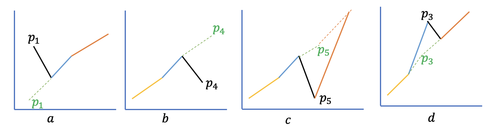

# Array

- [Sum of Two Numbers](#sum-of-two-numbers) - [Java](./SumOfTwo.java) [Python](../../../python/TwoSumLE.py) [Scala](../../../scala/src/com/ds/scala/practice/TwoSumLE.scala) [JavaScript](../../../javascript/two_sum.js)
- [First non-repeating character](#first-non-repeating-character) - [Java](./FirstNonRepeatingCharacter.java)
- [Validate Subsequence Array](#validate-subsequence-array) - [Java](./ValidSubsequence.java)
- [Is Validate Subsequence](#is-validate-subsequence) - [Java](./ValidSubsequence2.java)
- [Squares of a Sorted Array](#square-of-a-sorted-array) - [Java](./SquaresOfASortedArray.java)
- [Remove Duplicates from Sorted Array](#remove-duplicates-from-sorted-array) - [Java](./RemoveDuplicateFromSortedArray.java)
- [Monotonic Array](#monotonic-array) - [Java](./MonotonicArray.java)
- [Move Zeroes](#move-zeroes) - [Java](./MonotonicArray.java)
- [Product of Array Except Self](#product-of-array-except-self) - [Java](./CalculateProductExceptItself.java)
- [Non-decreasing Array](#non-decreasing-array) - [Java](./NonDecreasingArray.java)
- [Smallest Difference](#smallest-difference) - [Java](./SmallestDifference.java)
- [Running Sum of 1d Array](#running-sum-of-1d-array) - [Java](./RunningSum.java)
- [Sort Array By Parity](#sort-array-by-parity) - [Java](./SortArrayByParity.java)
- [Find Second Maximum Value in an Array](./SecondMaximumValue.java)
- [Best Time to Buy and Sell Stock](./BuyAndSellStockLE.java)
- [Count and Say](./CountAndSay.java)
- [Maximum distance between two unequal elements](./MaximumDistanceBetweenUniqueNumbers.java)
- [Largest Divisible Subset](./LargestDivisibleSubset.java)
- [Array of Doubled Pairs](./ArrayOfDoubledPairs.java)
- [Intersection of Two Arrays II](./IntersectionOfTwoArraysII.java)

#### Sum of Two Numbers
Given an array of integers `nums` and an integer `target`, return indices of the two numbers such that they add up to target.

You may assume that each input would have exactly one solution, and you may not use the same element twice.

You can return the answer in any order.

Example: 
```
Input: nums = [2,7,11,15], target = 9
Output: [0,1]
Output: Because nums[0] + nums[1] == 9, we return [0, 1].

Input: nums = [11,15,7,-6,1], target = 9
Output: [1,3]
Output: Because nums[1] + nums[3] == 9, we return [1, 3].
```

**Solution**
Brute-force solution will be compare every two numbers in the given array and check their 
sum with target. We will need two loops to get the combinations with every two numbers which
will cause *O(n^2)* time complexity and *O(1)* space complexity.

In the above solution we are evaluating each number twice, first pick one number and then pick 
another from the list. Can we do it with single pass.

Here is the formula for the problem: `num1 + num2 = target`, we can modify a little, `num1 = target - num2`.
For a given array  and target, target is constant in the equation. Target value is not changing. Then 
there are two variables only, `num1` and `num2`. 

The idea is to save every number that is visited so far, also keep their index. Then for every new number 
 we will calculate `target-num2` and check if we have seen the value. If  `num1 + num2 = target` then
 at some point there will be a match. Then we get the index from the previously seen number and 
 use current index as result.

*Time Complexity*: *O(n)*\
*Space Complexity*: *O(n)* 

#### First non-repeating character
Given a string s consisting of small English letters, find and return the first instance of a non-repeating character in it. 
If there is no such character, return `'_'`.

Example: 
```
Input: "abacabad"
Output: c
There are 2 non-repeating characters in the string: 'c' and 'd'. 
Return c since it appears in the string first.

Input: "abacabaabacaba"
Output: -
There are no characters in this string that do not repeat.
```

**Solution**
There are two key things, non-repeating character and the sequence, first.

We can think of two step or two pass solution. In the first step we do some processing that
will help us to find the non-repeating characters and then in the second step we find the first
non-repeating character.

In first pass, we can count the occurrence of each character in the string using hash map. Then 
in the second pass for each character, starting from the left, we check the occurrence count in the 
hash map. If the count is 1 then the character is the first non-repeating character.

*Time Complexity*: *O(n)*\
*Space Complexity*: *O(n)* 

[Implementation](./FirstNonRepeatingCharacter.java)

#### Validate Subsequence Array
Given two non-empty arrays of integers, write a function that determines whether the second array is a subsequence of the first one.

A subsequence of an array is a set of numbers that aren't necessarily adjacent 
in the array but that are in the same order as they appear in the array. For instance, the numbers `[1, 3, 4]` form a subsequence of 
the array `[1, 2, 3, 4]` , and so do the numbers `[2, 4]`. 

Note that a single number in an array and the array itself are both valid subsequences of the array.        

Example:
```
Input: [5, 1, 22, 25, 6, -1, 8, 10],
Sequence: [5, 1, 22, 6, -1, 8, 10]
Output: true
```

**Solution**
We can iterate over the input array and have a pointer pointing the first number in the sequence.
While iterating over the input array, we check if the current number matches the sequence number. 
If matches then we increment the sequence pointer to check next number in the sequence. 

*Time Complexity*: *O(n)*\
*Space Complexity*: *O(n)* 

[Implementation](./ValidSubsequence.java)

#### Is Validate Subsequence 
Given two strings `s` and `t`, return true if `s` is a subsequence of `t`, or `false` otherwise.

A subsequence of a string is a new string that is formed from the original string by deleting 
some (can be none) of the characters without disturbing the relative positions of the remaining 
characters. (i.e., "ace" is a subsequence of "abcde" while "aec" is not).


**Solution**
Same as [Validate Subsequence Array](#validate-subsequence-array).

*Time Complexity*: *O(n)*\
*Space Complexity*: *O(n)* 

[Implementation](./ValidSubsequence2.java)

#### Squares of a Sorted Array
Given an integer array nums sorted in non-decreasing order, return an array of the squares of
each number sorted in non-decreasing order.

Example:
```
Input: nums = [-4,-1,0,3,10]
Output: [0,1,9,16,100]
Explanation: After squaring, the array becomes [16,1,0,9,100].
After sorting, it becomes [0,1,9,16,100].

Input: nums = [-7,-3,2,3,11]
Output: [4,9,9,49,121]

Input: nums = [-3,-2,-1,0,1,2,3]
Output: [0,1,1,4,4,9,9]

Input: nums = [-3,-2,-1,0,1,2]
Output: [0,1,1,4,4,9]
```
**Solution**
If all the numbers are positive and numbers are in increasing order then the squares will be also be the same order.
But, if there are negative numbers then orders won't be the same because square of a negative number is positive.

That means, square of `-7` is `49`. So for `[-3,0,1,2,4]` squares will be `[9,0,1,4,16]`. Here the squares of the positive numbers are 
in increasing order but not for the negative number.

If we want to keep the squares in incremental order then we need to consider the numbers without sign.
The bigger numbers  will be either on the right end, for positive numbers or at the begining of negative numbers.

We can have two pointers, one pointing at the beginning of the list and one at the end. Then we iterate over the list of numbers.
In each iteration we compare the number at the beginning and end and take the bigger one, do square and store in result from the end.

*Time Complexity*: *O(n)*\
*Space Complexity*: *O(n)* 

[Implementation](./SquaresOfASortedArray.java)


#### Sum of 3 number
Given an integer array nums, return all the triplets `[nums[i], nums[j], nums[k]]` such that `i != j`, `i != k`, and `j != k`, and `nums[i] + nums[j] + nums[k] == 0`.

Notice that the solution set must not contain duplicate triplets.

Example:
```
Input: nums = [-1,0,1,2,-1,-4]
Output: [[-1,-1,2],[-1,0,1]]

Input: nums = []
Output: []
```

**Solution**
Lets represent the problem in equation: 
```
a + b + c = 0
a + b = -c 
```
High level idea is we pick a number from the list which we consider as target, like two sum problem, then we try 
to find two numbers whose sum is negative of the target. And we find `a` and `b` in the remaining list. 

It might be possible that there is no two number, `a` & `b` that sum to `-c`. To reduce the search space
we can sort the array and then search. 


*Time Complexity*: *O(n^2)*\
*Space Complexity*: *O(n)* 

[Implementation](./SumOfThree.java)
  
#### Remove Duplicates from Sorted Array
Given an integer array nums sorted in non-decreasing order, remove the duplicates in-place such that 
each unique element appears only once. The relative order of the elements should be kept the same.

Example:
```
Input: nums = [1,1,2]
Output: 2, nums = [1,2,_]
Explanation: Your function should return k = 2, with the first two elements of nums being 1 and 2 respectively.
It does not matter what you leave beyond the returned k (hence they are underscores).

Input: nums = [0,0,1,1,1,2,2,3,3,4]
Output: 5, nums = [0,1,2,3,4,_,_,_,_,_]
Explanation: Your function should return k = 5, with the first five elements of nums being 0, 1, 2, 3, and 4 respectively.
It does not matter what you leave beyond the returned k (hence they are underscores).
```

**Solution**
Keep a pointer for non duplicate number, initially point at the first index of the array.

As the array is sorted then, duplicate elements will be consecutive but in different blocks, for 
example: `[0,1,1,1,1,2,2,3,3,3,4,5,5,5]`.

Iterate over the numbers and keep checking if last number(non duplicate) is same as current number or not. If not then 
add the current number next to last non-duplicate number; otherwise check the next number.

*Time Complexity*: *O(n)*\
*Space Complexity*: *O(n)* 

[Implementation](./RemoveDuplicateFromSortedArray.java)

#### Monotonic Array
An array is monotonic if it is either monotone increasing or monotone decreasing.

An array nums is monotone increasing if for all `i <= j`, `nums[i] <= nums[j]`.  An array nums is monotone decreasing if for all `i <= j`, `nums[i] >= nums[j]`.

Return true if and only if the given array nums is monotonic.
Example:
```
Input: nums = [1,2,2,3]
Output: true

Input: nums = [1,3,2]
Output: false

Input: nums = [1,2,4,5]
Output: true

Input: nums = [1,1,1]
Output: true
```

**Solution**
Check first two numbers to identify if the array suppose to be incremental or decremental. And then 
base on the type, check every consecutive pairs.

*Time Complexity*: *O(n)*\
*Space Complexity*: *O(n)* 

[Implementation](./MonotonicArray.java)

#### Move Zeroes
Given an array nums, write a function to move all 0's to the end of it while
 maintaining the relative order of the non-zero elements.
 
Example:
```
Input: [0,1,0,3,12]
Output: [1,3,12,0,0]
``` 

**Solution**
We could have just swapped the zeors to last position but it will break relative ordering 
of the non-zero numbers. So we will have a pointer variable refer  to the array index of 
next non-zero element position. Initially it will be set to zero then increments on every swap. 
We will do swap when the current index is pointing to 0.

**Time Complexity:**\
*O(n)*
**Space Complexity:**\
*O(1)*

[Implementation](./MoveZeros.java)

#### Product of Array Except Self
Given an array nums of `n` integers where `n > 1`, return an array output such that `output[i]` is equal to the product of all the elements of nums except `nums[i]`. 

Example:
```
Input array is [4, 5, 9, 3]
Output should be [135, 108, 60, 180]
```

**Solution**
We can use extra space to store product of all the elements in the left except current one in one array. 
Similarly, store product of all the elements in right except current in another array. Then for each position/item we multiply product of left array and product of right array.

**Time Complexity:**\
There are two loops, the complexity is *O(2n)* = *O(n)*.\
**Space Complexity**\
As we are using three arrays, the space complexity is *O(3n)*=*O(n)*

#### Non Decreasing Array
Given an array *nums* with *n* integers, your task is to check if it could become non-decreasing by modifying at most *1* element.

We define an array is non-decreasing if *nums[i] <= nums[i + 1]* holds for every *i (0-based)* such that *(0 <= i <= n - 2)*.\\
```
Input: [5, 2, 4]
Output: True
change 5 to 1, [1, 2, 4]

Input: [3, 2, 5, 4]
Output: False
There are two downwards scenerio, 3 to 2, 5 to 4. Its posible to fix only one, not both. 
```


**Solution:**\
Here, key points are: `non-decreasing`, `modify at most once`. Non-decreasing means equal or increasing. Let's discard a obvious case: if there are more than one scenario where the numbers are decreasing then return `False`. Because we are allowed to fix only one such occurrence.
So we have to find decreasing pattern in the array, if there is none then return true. Decreasing pattern will be like this: 
```
array[i] > array[i+1] 
or
array[i-1] > array[i]
```

Let's point some decreasing cases and how to fix them:

 

In *a)* if start index of decreasing line is the first  element then we can easily plot the stating point in reference to the next.
For example: *[5, 3, 6]*, so we just need to move first element less than or equal to the next element, that is [2, 3, 6]

In *b)*, if start index of decreasing line is the last element then we can easily plot the last point in reference to the previous point.
For example: *[2, 5, 3]*, update last point equal to second last point or more than that. *[2, 5, 6]*

If start index of decreasing line is in between first and last element then there could be two cases:
In *c)*, if *[index + 2] >= [index]* then we can fix this case by moving *[index+1]* up equal to *[index + 2]*.
in *d)*, if *[index + 1] >= [index - 1]* then we can fix this case by moving *[index]* down equal to *[index-1]* or *[index+1]*

**Time Complexity**\
This approach is single pass, so time complexity is *O(n)*.

**Space Complexity**\
Constant space

[Implementation](./NonDecreasingArray.java)


#### Smallest Difference
Write a function that takes in two non-empty arrays of integers, finds the pair of numbers (one from each array) whose absolute 
difference is closest to zero, and returns an array containing these two numbers, with the number from the first array in the first position.

Note that the absolute difference of two integers is the distance between them on the real number line. For example, the absolute 
difference of -5 and 5 is 10, and the absolute difference of -5 and -4 is 1.

Example:
```
array1 = [-1, 5, 10, 20, 28, 3]
array2 = [26, 134, 135, 15, 17]
Output: [26,28]
```

**Solution**
In the naive approach we can use two loops. For each number in one array we compare absolute difference with 
every other element in the other array and keep updating the pari when we see a smaller difference. Time complexity 
will be *O(n^2)*.

We can optimize this, by sorting both arrays in either ascending or descending order. After sorting the arrays
consider in ascending order, all the smaller elements will be at the begining.
We use two pointer, pointing start of both array, initially pointing the smallest element in both array,

Then we compare both number pointed by the pointer. If both numbers are same then we return the numbers as their 
absolute difference is zero. Otherwise, if number in array one is greater than number in array two then 
we increment the pointer whose value is less, move to next number which may be higher. We also keep 
calculating the absolute difference and compare with lastly calculated absolute difference.
If current difference is less then we update the min difference and the numbers are saved.


**Time Complexity:**\
*O(n log n)*
**Space Complexity:**\
*O(1)*

[Implementation](./NonDecreasingArray.java)

#### Running Sum of 1d Array
Given an array nums. We define a running sum of an array as `runningSum[i] = sum(nums[0]…nums[i])`.

Return the running sum of nums.

Example:
```
Input: nums = [1,2,3,4]
Output: [1,3,6,10]
Explanation: Running sum is obtained as follows: [1, 1+2, 1+2+3, 1+2+3+4].

Input: nums = [1,1,1,1,1]
Output: [1,2,3,4,5]
Explanation: Running sum is obtained as follows: [1, 1+1, 1+1+1, 1+1+1+1, 1+1+1+1+1].
```

**Solution**
We can keep the previous sum till *(i-1)-th* position, and the sum of *i-th* position will be
previous sum + number at *i-th* position.

**Time Complexity:**\
*O(n)*
**Space Complexity:**\
*O(1)*

[Implementation](./RunningSum.java)

#### Sort Array By Parity
Given an array nums of non-negative integers, return an array consisting of all the even elements of nums, followed by all the odd elements of nums.

You may return any answer array that satisfies this condition.

Example: 
```
Input: nums = [3,1,2,4]
Output: [2,4,3,1]
The outputs [4,2,3,1], [2,4,1,3], and [4,2,1,3] would also be accepted.

```

**Time Complexity:**\
*O(n)*
**Space Complexity:**\
*O(1)*

[Implementation](./SortArrayByParity.java)
